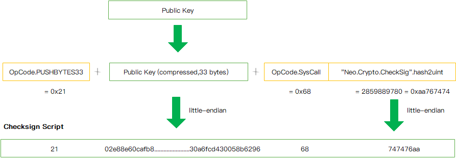

## 交易

<!-- TOC -->

- [交易结构](#交易结构)
    - [version](#version)
    - nonce
    - validUntilBlock
    - [sender](#sender)
    - [systemFee](#systemFee)
    - [networkFee](#networkFee)
    - [attributes](#attributes)
        - [属性使用类型](#属性使用类型)
    - [script](#script)
    - [witnesses](#witnesses)
        - [调用脚本](#调用脚本)
        - [验证脚本](#验证脚本)
- [交易序列化](#交易序列化)
- [交易签名](#交易签名)
<!-- /TOC -->

### NEO3 变更

1. NEO3弃用了UTXO模型，仅保留有账户余额模型
2. NEO3取消了每笔交易10 GAS的免费额度，系统费用总额受合约脚本的指令数量和指令类型影响

Neo中的交易是带签名的数据包，是操作Neo网络的唯一方式。Neo区块链账本中的每个区块都包含有一个或多个交易，使得每个区块可以对交易进行批处理。一笔交易由客户端发起，经由钱包封装属性并签名后发往钱包所属的节点。网络中的任意节点都可以对接收到的交易进行验证，并转发至共识节点。共识节点会选择性的将交易打包到提案块中并广播进行共识。共识通过后广播至网络中的节点，各节点会对区块中的每笔交易进行验证并更新各自的账本。

### 交易结构

一笔普通交易的数据结构如下所示：

| 字段        | 类型    | 说明                              |
|--------------|---------|------------------------------------------|
| `version`    | byte   | 交易版本号，目前为0                    |
| `nonce`    | uint   | 随机数                   |
| `validUntilBlock`    | uint   |  交易的有效期                |
| `sender`    | UInt160   | 发送方的地址脚本哈希                    |
| `systemFee`    | long   | 支付给网络的资源费用     |
| `networkFee`    | long   | 支付给验证人打包交易的费用    |
| `attributes` | tx_attr[]   | 交易所具备的额外特性  |
| `script`     | byte[]   | 交易的合约脚本 |
| `witnesses`  | Witness[]   | 用于验证交易的脚本列表    |

#### version
version属性允许对交易结构进行更新，使其具有向后兼容性。 目前版本为0。
#### sender
由于NEO3弃用了UTXO模型，仅保留有账户余额模型。原生资产NEO和GAS的转账交易统一为NEP-5资产操作方式，因此交易结构中不再记录inputs和outputs字段，通过sender字段来跟踪交易的发送方。该字段是钱包中交易发起账户的脚本哈希值。
#### systemFee
系统费用是根据NeoVM要执行的指令计算得出的固定费用。NEO3取消了每笔交易10 GAS的免费额度，系统费用总额受合约脚本的指令数量和指令类型影响。计算公式如下所示：

其中，OpcodeSet为指令集，为第i种指令的费用，为第i种指令在合约脚本中的个数。
#### networkFee
网络费是用户向Neo网络提交交易时支付的费用，作为共识节点的出块奖励。每个交易的网络费存在一个最小值，计算公式如下所示：

其中，VerificationCost为虚拟机验证交易签名消耗的费用，tx.Length为交易数据的字节长度，FeePerByte为交易每字节的费用。用户支付的网络费需要大于或等于此最小值，否则交易无法通过验证。
#### attributes
根据具体的交易类型允许向交易添加额外的属性。 对于每个属性，必须指定使用类型，以及外部数据和外部数据的大小。

| 字段| 类型| 说明|
|----------|-------|------------------------|
| `usage`  | uint8 | 属性使用类型                  |
| `data`   | byte[] |   交易待校验脚本，当usage=0x20时，data的值类型必须是 UIint160   |

##### 属性使用类型
以下使用类型可以包括在交易的属性中。

| 值    | 名称| 说明| 类型|
|---------------|-------------|---------------|--------------|
| `0x20`           | `Cosigner`    |  签名验证          | `byte`   |
| `0x81`           | `Url`          | 外部介绍信息地址    | `byte`  |

​每个交易最多可以添加16个属性。

#### script
  虚拟机所执行的合约脚本。
#### witnesses
witnesses属性用于验证交易的有效性和完整性。Witness即“见证人”， 包含两个属性。

| 字段 | 说明|
|--------------|------------------|
| `InvocationScript`   | 调用脚本，向验证脚本传递参数      |
| `VerificationScript` |验证脚本   |

可以为每个交易添加多个见证人，也可以使用具有多方签名的见证人。

##### 调用脚本

调用脚本可以通过以下步骤进行构造：

1.	`0x40`（PUSHBYTES64）后跟64字节长的签名

通过重复这些步骤，调用脚本可以为多方签名合约推送多个签名。

##### 验证脚本

具有单个签名的验证脚本可以通过以下步骤进行构建：

1. `0x21`（PUSHBYTES33）后跟33字节长的与签名相对应的公钥
2. `0x68`（SysCall）系统调用
3. `0xaa767474` 调用互操作服务 `Neo.Crypto.CheckSig` 用所提供的公钥对签名进行验证

单签名脚本构造如下图所示：

多方签名合约的验证脚本可以通过以下步骤进行构建：

1. `0x52`（PUSH2）到`0x60`（PUSH16）表示所需的签名数量
2. `0x21`（PUSHBYTES33）后跟多方签名合约的第一个33字节长的公钥，对多方签名合约中的每个公钥重复执行这个步骤
3. `0x52`（PUSH2）到`0x60`（PUSH16）表示签名的公钥总数
4. `0x68`（SysCall）系统调用
5. `0xba4cc3c7` 调用互操作服务 `Neo.Crypto.CheckMultiSig` 用所提供的公钥对签名进行验证

为了保证性能，在验证多方签名合约时，公钥和签名的顺序必须保持一致。多方签名脚本构造如下图所示：

   

### 交易序列化

除IP地址和端口号外，Neo中所有变长的整数类型都使用小端存储。交易序列化时将按以下字段顺序执行序列化操作：

| 字段| 说明|
|----------|------------|
| `version`  | - |
| `nonce`   | - |
| `sender`   | - |
| `systemFee`   | - |
| `networkFee`   | -|
| `validUntilBlock`   | - |
| `attributes`   |需先序列化数组长度`WriteVarInt(length)`，之后再分别序列化数组各个元素 |
| `script`   | 需先序列化数组长度`WriteVarInt(length)`，之后再分别序列化数组各个元素 |
| `witnesses`   | 需先序列化数组长度`WriteVarInt(length)`，之后再分别序列化数组各个元素 |

> 注意，WriteVarInt（value) 是根据value的值，存储非定长类型, 根据取值范围决定存储大小。
> 
> | Value 值范围 | 存储类型 |
> |--------------------|--------------|
> | value < 0xFD | byte(value) |
> | value <= 0xFFFF | 0xFD + ushort(value) |
> | value <= 0xFFFFFFFF | 0xFE + uint(value) |
> | value > 0xFFFFFFFF | 0xFF + value |

### 交易签名
一笔交易由客户端发起，经钱包模块封装属性并附加数字签名，确保在后续传输和处理中能随时验证交易是否被篡改。Neo采用的ECDSA数字签名方法。交易的转账转出方地址，为ECDSA签名时所用的公钥publicKey。Neo每笔交易都包含自己的Script.witness，而Script.Witness使用的是智能合约。

见证人，实际上是可执行的验证脚本。InvocationScript 脚本传递了VerificationScript脚本所需要的参数。只有当脚本执行返回真时，验证成功。调用脚本进行压栈操作相关的指令，用于向验证脚本传递参数（如签名等）。脚本解释器会先执行调用脚本代码，然后再执行验证脚本代码。

> 注意：交易签名是对交易本身的数据（不包含签名数据，即witness部分）进行签名。

