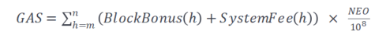

# 智能合约

<!-- TOC -->

- [智能合约](#智能合约)
    - [NEO3变更部分](#neo3变更部分)
    - [Manifest](#manifest)
    - [触发器](#触发器)
    - [原生合约](#原生合约)
        - [介绍](#介绍)
        - [**NeoToken**](#neotoken)
        - [**GasToken**](#gastoken)
        - [**PolicyContract**](#policycontract)
    - [互操作服务](#互操作服务)
        - [互操作服务原理](#互操作服务原理)
        - [互操作服务使用](#互操作服务使用)
        - [System部分](#system部分)
            - [System.Binary.Serialize](#systembinaryserialize)
            - [System.Binary.Deserialize](#systembinarydeserialize)
            - [System.Blockchain.GetHeight](#systemblockchaingetheight)
            - [System.Blockchain.GetBlock](#systemblockchaingetblock)
            - [System.Blockchain.GetTransaction](#systemblockchaingettransaction)
            - [System.Blockchain.GetTransactionHeight](#systemblockchaingettransactionheight)
            - [System.Blockchain.GetTransactionFromBlock](#systemblockchaingettransactionfromblock)
            - [System.Blockchain.GetContract](#systemblockchaingetcontract)
            - [System.Contract.Create](#systemcontractcreate)
            - [System.Contract.Update](#systemcontractupdate)
            - [System.Contract.Destroy](#systemcontractdestroy)
            - [System.Contract.Call](#systemcontractcall)
            - [System.Contract.CallEx](#systemcontractcallex)
            - [System.Contract.IsStandard](#systemcontractisstandard)
            - [System.Enumerator.Create](#systemenumeratorcreate)
            - [System.Enumerator.Next](#systemenumeratornext)
            - [System.Enumerator.Value](#systemenumeratorvalue)
            - [System.Enumerator.Concat](#systemenumeratorconcat)
            - [System.Iterator.Create](#systemiteratorcreate)
            - [System.Iterator.Key](#systemiteratorkey)
            - [System.Iterator.Keys](#systemiteratorkeys)
            - [System.Iterator.Values](#systemiteratorvalues)
            - [System.Iterator.Concat](#systemiteratorconcat)
            - [System.Json.Serialize](#systemjsonserialize)
            - [System.Json.Deserialize](#systemjsondeserialize)
            - [System.Runtime.Platform](#systemruntimeplatform)
            - [System.Runtime.GetTrigger](#systemruntimegettrigger)
            - [System.Runtime.GetTime](#systemruntimegettime)
            - [System.Runtime.GetScriptContainer](#systemruntimegetscriptcontainer)
            - [System.Runtime.GetExecutingScriptHash](#systemruntimegetexecutingscripthash)
            - [System.Runtime.GetCallingScriptHash](#systemruntimegetcallingscripthash)
            - [System.Runtime.GetEntryScriptHash](#systemruntimegetentryscripthash)
            - [System.Runtime.CheckWitness](#systemruntimecheckwitness)
            - [System.Runtime.GetInvocationCounter](#systemruntimegetinvocationcounter)
            - [System.Runtime.Log](#systemruntimelog)
            - [System.Runtime.Notify](#systemruntimenotify)
            - [System.Runtime.GetNotifications](#systemruntimegetnotifications)
            - [System.Storage.GetContext](#systemstoragegetcontext)
            - [System.Storage.GetReadOnlyContext](#systemstoragegetreadonlycontext)
            - [System.Storage.Get](#systemstorageget)
            - [System.Storage.Find](#systemstoragefind)
            - [System.Storage.Put](#systemstorageput)
            - [System.Storage.PutEx](#systemstorageputex)
            - [System.Storage.Delete](#systemstoragedelete)
            - [System.StorageContext.AsReadOnly](#systemstoragecontextasreadonly)
        - [Neo部分](#neo部分)
            - [Neo.Native.Deploy](#neonativedeploy)
            - [Neo.Crypto.ECDsaVerify](#neocryptoecdsaverify)
            - [Neo.Crypto.ECDsaCheckMultiSig](#neocryptoecdsacheckmultisig)
    - [网路资源访问](#网路资源访问)
    - [合约调用](#合约调用)
        - [在合约中调用其他合约](#在合约中调用其他合约)
        - [脚本中调用合约](#脚本中调用合约)
    - [合约升级](#合约升级)
    - [合约销毁](#合约销毁)

<!-- /TOC -->

## NEO3变更部分

NEO3中所有交易都是智能合约的调用，除了一些互操作指令和OpCode的调整，NEO3中比较大的特性包括：

- 新增
    - [Manifest文件](#manifest)：用于描述合约的特征，随nef文件一起部署到Neo区块链。
    - [原生合约](#原生合约)：不通过虚拟机执行，而直接运行在Neo原生代码中，目前包括：NeoToken，GasToken，以及PolicyContract。
    - [网络资源访问](#网路资源访问)： 待补充。
    - [system 触发器](#触发器)：用于节点收到新区块后，触发原生合约的执行。
    - 互操作服务接口：`System.Binary.Serialize`, `System.Binary.Deserialize`, `System.Contract.Create`, `System.Contract.Update`, `System.Contract.Call`, `System.Contract.CallEx`, `System.Contract.IsStandard`, 
    `System.Enumerator.Create`, `System.Enumerator.Next`, `System.Enumerator.Value`, `System.Enumerator.Concat`, `System.Iterator.Create`, `System.Iterator.Key`, `System.Iterator.Keys`, `System.Iterator.Values`, `System.Iterator.Concat`, `System.Json.Serialize`, `System.Json.Deserialize`, `System.Runtime.GetScriptContainer`, `System.Runtime.GetScriptContainer`,`System.Runtime.GetExecutingScriptHash`, `System.Runtime.GetCallingScriptHash`, `System.Runtime.GetEntryScriptHash`, `System.Runtime.GetInvocationCounter`, `System.Runtime.GetNotifications`, `System.Storage.Find`, `Neo.Native.Deploy`, `Neo.Crypto.ECDsaVerify`, `Neo.Crypto.ECDsaCheckMultiSig`.
- 更新
    - 降低了合约执行互操作接口所对应的[系统费用](#费用)。

- 删除
    - 互操作服务接口：`System.ExecutionEngine.GetScriptContainer`, `System.ExecutionEngine.GetExecutingScriptHash`, `System.ExecutionEngine.GetCallingScriptHash`, `System.ExecutionEngine.GetEntryScriptHash`, `System.Runtime.Serialize`, `System.Runtime.Deserialize`, `System.Header.GetIndex`, `System.Header.GetHash`, `System.Header.GetPrevHash`, `System.Header.GetTimestamp`, `System.Block.GetTransactionCount`, `System.Block.GetTransactions`, `System.Block.GetTransaction`, `System.Transaction.GetHash`, `System.Contract.GetStorageContext`, 
    `Neo.Runtime.GetTrigger`, `Neo.Runtime.CheckWitness`, `Neo.Runtime.Notify`, `Neo.Runtime.Log`, `Neo.Runtime.GetTime`, `Neo.Runtime.Serialize`, `Neo.Runtime.Deserialize`, `Neo.Blockchain.GetHeight`, `Neo.Blockchain.GetHeader`, `Neo.Blockchain.GetBlock`, `Neo.Blockchain.GetTransaction`, `Neo.Blockchain.GetTransactionHeight`, `Neo.Blockchain.GetAccount`, `Neo.Blockchain.GetValidators`, `Neo.Blockchain.GetAsset`, `Neo.Blockchain.GetContract`, `Neo.Header.GetHash`, `Neo.Header.GetVersion`, `Neo.Header.GetPrevHash`, `Neo.Header.GetMerkleRoot`, `Neo.Header.GetTimestamp`, `Neo.Header.GetIndex`,  `Neo.Header.GetConsensusData`, `Neo.Header.GetNextConsensus`, `Neo.Block.GetTransactionCount` , `Neo.Block.GetTransactions`, `Neo.Block.GetTransaction`, `Neo.Transaction.GetHash`, `Neo.Transaction.GetType`,  `Neo.Transaction.GetAttributes`, `Neo.Transaction.GetInputs`, `Neo.Transaction.GetOutputs`, `Neo.Transaction.GetReferences`, `Neo.Transaction.GetUnspentCoins`, `Neo.Transaction.GetWitnesses`, `Neo.InvocationTransaction.GetScript`, `Neo.Witness.GetVerificationScript`, `Neo.Attribute.GetUsage`, `Neo.Attribute.GetData`, `Neo.Input.GetHash`, `Neo.Input.GetIndex`, `Neo.Output.GetAssetId`, `Neo.Output.GetValue`, `Neo.Output.GetScriptHash`, `Neo.Account.GetScriptHash` , `Neo.Account.GetVotes`, `Neo.Account.GetBalance`, `Neo.Account.IsStandard`, `Neo.Asset.Create`, `Neo.Asset.Renew`, `Neo.Asset.GetAssetId` , `Neo.Asset.GetAssetType`, `Neo.Asset.GetAmount`, `Neo.Asset.GetAvailable`, `Neo.Asset.GetPrecision`, `Neo.Asset.GetOwner`, `Neo.Asset.GetAdmin`, `Neo.Asset.GetIssuer`, `Neo.Contract.Create`, `Neo.Contract.Migrate`, `Neo.Contract.Destroy`, `Neo.Contract.GetScript`, `Neo.Contract.IsPayable`, `Neo.Contract.GetStorageContext`, `Neo.Storage.GetContext` , `Neo.Storage.GetReadOnlyContext`,  `Neo.Storage.Get`, `Neo.Storage.Put`, `Neo.Storage.Delete`, `Neo.Storage.Find`, `Neo.StorageContext.AsReadOnly`, `Neo.Enumerator.Create`, `Neo.Enumerator.Next`, `Neo.Enumerator.Value`, `Neo.Enumerator.Concat`, `Neo.Iterator.Create`, `Neo.Iterator.Key`, `Neo.Iterator.Keys`, `Neo.Iterator.Values`, `Neo.Iterator.Concat`. 
    
## Manifest
> **NEO3 变更**: 新添加了Manifest文件，随nef文件一起部署到Neo区块链

现在每个合约都需要对应的manifest文件描述其属性，其内容包括：Groups， Features， ABI，Permissions， Trusts， SafeMethods。

一个manifest内容示例如下：
```json
{
    "groups": [
        {
            "pubKey": "",
            "signature": ""
        }
    ],
    "features": {
        "storage": false,
        "payable": false
    },
    "abi": {
      "hash": "0x562851057d8afbc08fabc8c438d7cc771aef2195",
      "entrypoint": {
        "name": "main",
        "parameters": [
          {
            "name": "operation",
            "type": "String"
          },
          {
            "name": "args",
            "type": "Array"
          }
        ],
        "returntype": "Any"
      },
      "methods": [
        {
          "name": "name",
          "parameters": [],
          "returntype": "string"
        }
      ],
      "events": [
        {
          "name": "transfered",
          "parameters": [
            {"name": "from","type": "Hash160"},
            {"name": "to","type": "Hash160"},
            {"name": "value","type": "Integer"}
          ]
        }
      ]
    },
    "permissions": [
        {
            "contract": "*",
            "methods": "*"
        }
    ],
    "trusts": "*",
    "safemethods": "*"
}
```
- **Groups**：声明本合约所归属的组，可以支持多个, 每一个组由一个公钥和签名表示。
- **Features**：声明智能合约的特性。其中属性值`storage`表明合约可以访问存储区, `payable`表明合约可以接受资产的转入。
- **ABI**：声明智能合约的接口信息，可以参考[NEP-3](https://github.com/neo-project/proposals/blob/master/nep-3.mediawiki)。接口的基础属性包括:
  - Hash: 16进制编码的合约脚本哈希;
  - EntryPoint: 提供了合约入口方法的详细信息，包括方法名、方法参数以及方法返回值;
  - Methods: 由合约方法的详细信息构成的数组;
  - Events: 由合约事件构成的数组。基于 ABI 信息，可实现合约间的相互调用。
- **Permissions**：声明合约可调用的其他合约和方法。执行合约调用时，会检查`Permission`中配置的权限，若没有相应权限，则调用操作会执行失败。
- **Trusts**：声明合约可以被哪些合约或者哪些合约组安全地调用。
- **SafeMethods**：声明哪些方法是SafeMethod，SafeMethod通常是不会修改存储区，只读取区块链数据的方法，被调用时不会给用户接口返回警告信息。

## 触发器

触发器可以使合约根据不同的使用场景执行不同的逻辑。
 > **NEO3 变更**: 新添加System触发器

- **System 触发器** 
  
  此触发器为NEO3新增触发器类型，仅用于NEO3新添加的原始合约中，即NEO和GAS。当节点收到新区块后触发，目前只会触发原生合约的执行。当节点收到新区块，持久化之前会调用所有原生合约的onPersist方法，只有触发方式为System才会继续执行。
  
  该触发器不对普通合约的执行造成任何影响。

- **Application 触发器** 

  应用触发器的目的在于将该合约作为应用函数进行调用，应用函数可以接受多个参数，对区块链的状态进行更改，并返回任意类型的返回值。以下是一个简单的C#智能合约：

  ```csharp
  public static Object Main(string operation, params object[] args)
  {
    if (Runtime.Trigger == TriggerType.Application)
    {
        if (operation == "FunctionA") return FunctionA(args);
    }  
  }
  public static bool FunctionA(params object[] args)
  {
    //some code  
  }
  ```

  NEO3中所有交易都为合约的调用，当一笔交易被广播和确认后，智能合约由共识节点执行，普通节点在转发交易时不执行智能合约。智能合约执行成功不代表交易的成功，而交易的成功也不决定智能合约执行的成功。

- **Verification 触发器** 
  
  验证触发器的目的在于将该合约作为验证函数进行调用，验证函数可以接受多个参数，并且应返回有效的布尔值，标志着交易或区块的有效性。

  当你想从 A 账户向 B 账户进行转账时，会触发验证合约，所有收到这笔交易的节点（包括普通节点和共识节点）都会验证 A 账户的合约，如果返回值为 true，即转账成功。如果返回 false，即转账失败。

  如果鉴权合约执行失败，这笔交易将不会被写入区块链中。

  下面的代码就是一个验证合约的简单示例，当条件 A 满足时，返回 true，即转账成功。否则返回 false，转账失败。

  ```csharp
  using Neo.SmartContract.Framework;
  using Neo.SmartContract.Framework.Neo;

  public static bool Main(byte[] signature)
  {
      if (/*条件A*/)
          return true;
      else
          return false;
  }
  ```

  下面的这段代码的作用与上面的基本相同，但对运行时的触发器进行了判断，仅当触发器为验证触发器时执行验证部分的代码，这在复杂的智能合约中很有用，如果一个智能合约实现了多种触发器，应该在 Main 方法中对触发器进行判断。

  ```csharp
  using Neo.SmartContract.Framework;
  using Neo.SmartContract.Framework.Neo;

  public static bool Main(byte[] signature)
  {
      if (Runtime.Trigger == TriggerType.Verification)
      {
          if (/*条件A*/)
                  return true;
              else
                  return false;
      }  
  }
  ```

## 原生合约
### 介绍
原生合约是直接在原生代码中执行，而不是在虚拟机中运行的合约。原生合约公开其服务名称，供其他合约调用。目前已有的原生合约包括NeoToken，GasToken，PolicyToken。

### **NeoToken**

简称 NEO，是Neo的治理代币，用于执行对 Neo 网络的管理权，符合 NEP-5 标准。NEO 的总量为 1 亿，最小单位为 1，且不可分割。Neo 在创世块中注册生成。具体接口细节如下：

> 标*的方法为[NEP-5](https://github.com/neo-project/proposals/blob/master/nep-5.mediawiki)标准接口

- **name***： Token的名称

  <table>
  <tr >
    <th >参数列表</th>
    <th colspan="2">无参数</th>
    </tr>
  <tr >
    <th  rowspan="2">返回值</th>
    <th  >返回值类型</th>
    <th   colspan="2">描述</th>
    </tr>
    <tr >
    <td  >String</td>
    <td colspan="2"  >Token的名称 </td>
    </tr>
    <tr >
    <th >费用（GAS）</th>
    <td colspan="2" >0.00</td>
    </tr>
  </table>
  在合约中调用示例

  ```csharp
  using Neo.SmartContract.Framework;
  using Neo.SmartContract.Framework.System;

  public static object Main(string method, object[] args)
  {
    private static string neoScriptHash = "0x43cf98eddbe047e198a3e5d57006311442a0ca15";
      if (Runtime.Trigger == TriggerType.Application)
      {
          if (method == "neoName") {
            string name = Contract.Call(neoScriptHash.HexToBytes(), "name", new object[]{});
            return name;
          }
      }  
  }
  ```
  拼接脚本示例

  通过System.Contract.Call来调用合约脚本为:
  ```
  PUSH0
  NEWARRAY
  PUSHBYTES4  6e616d65
  PUSHBYTES20 0x43cf98eddbe047e198a3e5d57006311442a0ca15
  SYSCALL     0x627d5b52
  ```

  生成脚本的C#代码为：
  ```
  ScriptBuilder sb = new ScriptBuilder()
  UInt160 scriptHash = UInt160.Parse("0x43cf98eddbe047e198a3e5d57006311442a0ca15");
  sb.EmitPush(0);
  sb.Emit(OpCode.NEWARRAY);
  sb.EmitPush("name");
  sb.EmitPush(scriptHash);
  sb.EmitSysCall(InteropService.System_Contract_Call);
  byte[] script = sb.ToArray();
  ```
- **symbol***：Token的简称

  <table>
  <tr >
    <th >参数列表</th>
    <th colspan="2" >无参数</th>
    </tr>
    <tr >
    <th  rowspan="2">返回值</th>
    <th  >返回值类型</th>
    <th   colspan="2">描述</th>
    </tr>
    <tr >
    <td  >String</td>
    <td colspan="2"  >Token的简称 </td>
    </tr>
    <tr >
    <th >费用（GAS）</th>
    <th colspan="2" >0.00</th>
    </tr>
  </table>

- **decimals***: Token的计算精度

   <table>
  <tr >
    <th >参数列表</th>
    <th colspan="2" >无参数</th>
    </tr>
    <tr >
    <th  rowspan="2">返回值</th>
    <th  >返回值类型</th>
    <th   colspan="2">描述</th>
    </tr>
    <tr >
    <td  >Unit</td>
    <td colspan="2"  >Token的计算精度 </td>
    </tr>
    <tr >
    <th >费用（GAS）</th>
    <th colspan="2" >0.00</th>
    </tr>
  </table>

- **totalSupply***: 总发行量

   <table>
  <tr >
    <th >参数列表</th>
    <th colspan="2" >无参数</th>
    </tr>
    <tr >
    <th  rowspan="2">返回值</th>
    <th  >返回值类型</th>
    <th   colspan="2">描述</th>
    </tr>
    <tr >
    <td  >BigInteger</td>
    <td colspan="2"  >Token的总发行量 </td>
    </tr>
    <tr >
    <th >费用（GAS）</th>
    <th colspan="2" >0.01</th>
    </tr>
  </table>

- **balanceOf***: 指定地址的Token余额

  <table>
  <tr >
    <th rowspan="2">参数列表</th>
    <th >参数名称</th>
    <th >参数类型</th>
    <th  >描述</th>
    </tr>
    <tr >
    <td>account</td>
    <td >Hash160</td>
    <td>要查询账户的ScriptHash</td>
    </tr>
    <tr >
    <th  rowspan="2">返回值</th>
    <th  colspan="2">返回值类型</th>
    <th  >描述</th>
    </tr>
    <tr >
    <td colspan="2">BigInteger</td>
    <td >余额数值</td>
    </tr>
    <tr >
    <th >费用（GAS）</th>
    <th colspan="3" >0.01</th>
    </tr>
  </table>

- **transfer***: 转账

  <table>
    <tr >
    <th rowspan="4">参数列表</th>
    <th >参数名称</th>
    <th >参数类型</th>
    <th  >描述</th>
    </tr>
    <tr >
    <td>from</td>
    <td >Hash160</td>
    <td>转出账户的ScriptHash</td>
    </tr>
    <tr >
    <td>to</td>
    <td >Hash160</td>
    <td>转入账户的ScriptHash</td>
    </tr>
    <tr >
    <td>amount</td>
    <td >Integer</td>
    <td>转账的Token数量</td>
    </tr>
    <tr >
    <th  rowspan="2">返回值</th>
    <th  colspan="2">返回值类型</th>
    <th  >描述</th>
    </tr>
    <tr >
    <td colspan="2">Boolean</td>
    <td >转账结果，true：成功，false：失败</td>
    </tr>
    <tr >
    <th >费用（GAS）</th>
    <th colspan="3" >0.08</th>
    </tr>
  </table>
  在合约中调用示例

  ```csharp
  using Neo.SmartContract.Framework;
  using Neo.SmartContract.Framework.System;

  public static object Main(string method, object[] args)
  {
    private static string neoScriptHash = "0x43cf98eddbe047e198a3e5d57006311442a0ca15";
      if (Runtime.Trigger == TriggerType.Application)
      {
          if (method == "transferNeo") {
            byte[] from  = "AesUJTLg93cWMTSzp2snxpBJSCets89ebM".ToScriptHash();
            byte[] to    = "AMhbbwR8r6LuTx5okkZudvvp3LW6Fh1Y7o".ToScriptHash();
            BigInterger value = new BigInteger(100000000);
            bool result = Contract.Call(neoScriptHash.HexToBytes(), "transfer", new Object[]{from, to, value.AsByteArray()});
            return result;
          }
      }  
  }
  ```
  拼接脚本示例

  通过System.Contract.Call来调用合约脚本为:
  ```
  PUSHBYTE4   00e1f505
  PUSHBYTE20  4101b2a928fd88e1d976fd23c2db25a822338a08
  PUSHBYTE20  fd59e6a0e3eee5cd9cea7233f01e1cc9c8b23502
  PUSH3
  PACK
  PUSHBYTES4  7472616e73666572
  PUSHBYTES20 0x43cf98eddbe047e198a3e5d57006311442a0ca15
  SYSCALL     0x627d5b52
  ```

  生成脚本的C#代码为：
  ```
  ScriptBuilder sb = new ScriptBuilder()
  UInt160 scriptHash = UInt160.Parse("0x43cf98eddbe047e198a3e5d57006311442a0ca15");
  UInt160 from = UInt160.Parse("0xfd59e6a0e3eee5cd9cea7233f01e1cc9c8b23502");
  UInt160 to = UInt160.Parse("0x4101b2a928fd88e1d976fd23c2db25a822338a08");
  long value = 1000000000;
  sb.EmitPush(value);
  sb.EmitPush(to);
  sb.EmitPush(from);
  sb.Emit(OpCode.PUSH3);
  sb.Emit(OpCode.PACK);
  sb.EmitPush("transfer");
  sb.EmitPush(scriptHash);
  sb.EmitSysCall(InteropService.System_Contract_Call);
  byte[] script = sb.ToArray();
  ```
- **unClaimGas**：获取到指定高度，未claim的GAS数量

  <table class="mytable">
  <tr >
  <th rowspan="3">参数列表</th>
  <th >参数名称</th>
  <th >参数类型</th>
  <th  >描述</th>
  </tr>
  <tr >
  <td>account</td>
  <td >Hash160</td>
  <td>要查询账户的ScriptHash</td>
  </tr>
  <tr >
  <td >end</td>
  <td >Integer</td>
  <td >要查询的截止高度</td>
  </tr>
  <tr >
  <th  rowspan="2">返回值</th>
  <th colspan="2">返回值类型</th>
  <th >描述</th>
  </tr>
  <tr >
  <td colspan="2">integer</td>
  <td >未claimGAS数量 </td>
  </tr>
  <tr >
  <th >费用（GAS）</th>
  <td colspan="3" >0.03</td>
  </tr>
  </table>
  在合约中调用示例

  ```csharp
  using Neo.SmartContract.Framework;
  using Neo.SmartContract.Framework.System;

  public static object Main(string method, object[] args)
  {
    private static string neoScriptHash = "0x43cf98eddbe047e198a3e5d57006311442a0ca15";
      if (Runtime.Trigger == TriggerType.Application)
      {
          if (method == "accountUnClaimGas") {
            byte[] account = "AXx1A21wcoXuVxxxggkQChxQP5EGYe6zsN".ToScriptHash();
            int height = 1000000;
            int gas = Contract.Call(neoScriptHash.HexToBytes(), "unClaimGas", new Object[]{account, height});
            return gas;
          }
      }  
  }
  ```
  拼接脚本示例

  通过System.Contract.Call来调用合约脚本为:
  ```
  PUSHBYTE3   40420f
  PUSHBYTE20  b16c70b94928ddb62f5793fbc98d6245ee308ecd
  PUSH2
  PACK
  PUSHBYTES4  756e436c61696d476173
  PUSHBYTES20 0x43cf98eddbe047e198a3e5d57006311442a0ca15
  SYSCALL     0x627d5b52
  ```

  生成脚本的C#代码为：
  ```
  ScriptBuilder sb = new ScriptBuilder()
  UInt160 scriptHash = UInt160.Parse("0x43cf98eddbe047e198a3e5d57006311442a0ca15");
  UInt160 account = UInt160.Parse("0xb16c70b94928ddb62f5793fbc98d6245ee308ecd");
  int height = 1000000
  sb.EmitPush(height);
  sb.EmitPush(account);
  sb.Emit(OpCode.PUSH2);
  sb.Emit(OpCode.PACK);
  sb.EmitPush("unClaimGas");
  sb.EmitPush(scriptHash);
  sb.EmitSysCall(InteropService.System_Contract_Call);
  byte[] script = sb.ToArray();
  ```
- **RegisterValidator**：注册验证人

  <table class="mytable">
  <tr >
  <th rowspan="2">参数列表</th>
  <th >参数名称</th>
  <th >参数类型</th>
  <th  >描述</th>
  </tr>
  <tr >
  <td>pubKey</td>
  <td >PublicKey</td>
  <td>要注册验证人的账户的公钥</td>
  </tr>
  <tr >
  <th  rowspan="2">返回值</th>
  <th colspan="2">返回值类型</th>
  <th >描述</th>
  </tr>
  <tr >
  <td colspan="2">Boolean</td>
  <td >注册结果，true：成功， false：失败 </td>
  </tr>
  <tr >
  <th >费用（GAS）</th>
  <td colspan="3">0.05</td>
  </tr>
  </table>

- **getRegisteredValidators**：获取当前注册的验证人和备选节点信息

  <table class="mytable">
    <tr >
        <th >参数列表</th>
        <th colspan="2" >无参数</th>
    </tr>
    <tr >
        <th rowspan="2">返回值</th>
        <th >返回值类型</th>
        <th >描述</th>
    </tr>
    <tr >
        <td >Array</td>
        <td >所有验证人和备选节点信息 </td>
    </tr>
    <tr >
        <th >费用（GAS）</th>
        <td colspan="2" >1.00</td>
    </tr>
  </table>

- **getValidators**: 获取当前区块所有验证人信息

  <table class="mytable">
  <tr >
  <th >参数列表</th>
  <th colspan="2">无参数</th>
  </tr>
  <tr >
  <th  rowspan="2">返回值</th>
  <th  >返回值类型</th>
  <th  >描述</th>
  </tr>
  <tr >
  <td >Array</td>
  <td >所有验证人信息 </td>
  </tr>
  <tr >
  <th >费用（GAS）</th>
  <th colspan="2">1.00</th>
  </tr>
  </table>

- **getNextBlockValidators**: 获取下一个区块的验证人信息

  <table class="mytable">
  <tr >
    <th >参数列表</th>
    <th colspan="2">无参数</th>
    </tr>
  <tr >
    <th  rowspan="2">返回值</th>
    <th >返回值类型</th>
    <th  colspan="2">描述</th>
    </tr>
    <tr >
    <td  >Array</td>
    <td colspan="2"  >所有验证人信息 </td>
    </tr>
    <tr >
    <th >费用（GAS）</th>
    <th colspan="2">1.00</th>
    </tr>
  </table>

- **vote**：投票选举验证人

  <table class="mytable">
    <tr >
    <th rowspan="3">参数列表</th>
    <th >参数名称</th>
    <th >参数类型</th>
    <th  >描述</th>
    </tr>
    <tr >
    <td>account</td>
    <td >Hash160</td>
    <td>投票人的ScriptHash</td>
    </tr>
    <tr >
    <td >pubkeys</td>
    <td >Array</td>
    <td >投给验证人的公钥</td>
    </tr>
  <tr >
    <th  rowspan="2">返回值</th>
    <th  colspan="2">返回值类型</th>
    <th  >描述</th>
    </tr>
    <tr >
    <td  colspan="2">Boolean</td>
    <td  >投票结果，true：成功， false：失败 </td>
    </tr>
    <tr >
    <th >费用（GAS）</th>
    <th colspan="3">5.00</th>
    </tr>
  </table>

### **GasToken**

简称 GAS，Neo 的燃料代币，用于支付手续费，符合 NEP-5 标准。Neo 网络上的 交易费用和共识节点激励均以 GAS 来支付。GAS 总量 1 亿，最小单位 0.00000001。 GAS 在创始块中被注册，但未分发。  
GAS 的分发机制: 生成一个新区块时会伴随产生新的 GAS，所生成的 GAS 和系统 费会分发给 NEO 的持有者。用户地址中的 NEO 余额发生变化时会自动进行 GAS 的计 算和分发，计算方法如下图所示:  

 

其中，m 表示用户上一次提取 GAS 时所处的区块高度，n 为当前的区块高度，NEO 表示 m 至 n 期间用户持有的 NEO 的数量。BlockBonus 代表每个区块可以提取的 GAS 量，具体细节可参看经济模型部分。SystemFee 代表该区块中所有交易的系统费之和。GasToken的详细接口介绍如下：
> 标*的方法为[NEP-5](https://github.com/neo-project/proposals/blob/master/nep-5.mediawiki)标准接口
- **name**: Token的名称

  <table>
  <tr >
    <th >参数列表</th>
    <th colspan="2" >无参数</th>
    </tr>
    <tr >
    <th  rowspan="2">返回值</th>
    <th  >返回值类型</th>
    <th   colspan="2">描述</th>
    </tr>
    <tr >
    <td  >String</td>
    <td colspan="2"   >Token的名称 </td>
    </tr>
    <tr >
    <th >费用（GAS）</th>
    <th colspan="2" >0.00</th>
    </tr>
  </table>
- **symbol**: Token的简称

  <table>
  <tr >
    <th >参数列表</th>
    <th colspan="2" >无参数</th>
    </tr>
    <tr >
    <th  rowspan="2">返回值</th>
    <th  >返回值类型</th>
    <th   colspan="2">描述</th>
    </tr>
    <tr >
    <td  >String</td>
    <td colspan="2"  >Token的简称 </td>
    </tr>
    <tr >
    <th >费用（GAS）</th>
    <th colspan="2" >0.00</th>
    </tr>
  </table>

- **decimals**: Token的计算精度

  <table>
  <tr >
    <th >参数列表</th>
    <th colspan="2" >无参数</th>
    </tr>
    <tr >
    <th  rowspan="2">返回值</th>
    <th  >返回值类型</th>
    <th   colspan="2">描述</th>
    </tr>
    <tr >
    <td  >Unit</td>
    <td colspan="2"  >Token的计算精度 </td>
    </tr>
    <tr >
    <th >费用（GAS）</th>
    <th colspan="2" >0.00</th>
    </tr>
  </table>

- **totalSupply**: 总发行量

  <table>
  <tr >
    <th >参数列表</th>
    <th colspan="2" >无参数</th>
    </tr>
    <tr >
    <th  rowspan="2">返回值</th>
    <th  >返回值类型</th>
    <th   colspan="2">描述</th>
    </tr>
    <tr >
    <td  >BigInteger</td>
    <td colspan="2"  >Token的总发行量 </td>
    </tr>
    <tr >
    <th >费用（GAS）</th>
    <th colspan="2" >0.01</th>
    </tr>
  </table>

- **balanceOf**: 指定地址的Token余额

  <table>
  <tr >
    <th rowspan="2">参数列表</th>
    <th >参数名称</th>
    <th >参数类型</th>
    <th  >描述</th>
    </tr>
    <tr >
    <td>account</td>
    <td >Hash160</td>
    <td>要查询账户的ScriptHash</td>
    </tr>
    <tr >
    <th  rowspan="2">返回值</th>
    <th  colspan="2">返回值类型</th>
    <th  >描述</th>
    </tr>
    <tr >
    <td colspan="2">Integer</td>
    <td >余额数值</td>
    </tr>
    <tr >
    <th >费用（GAS）</th>
    <th colspan="3" >0.01</th>
    </tr>
  </table>

- **transfer**: 转账

  <table>
    <tr >
    <th rowspan="4">参数列表</th>
    <th >参数名称</th>
    <th >参数类型</th>
    <th  >描述</th>
    </tr>
    <tr >
    <td>from</td>
    <td >Hash160</td>
    <td>转出账户的ScriptHash</td>
    </tr>
    <tr >
    <td>to</td>
    <td >Hash160</td>
    <td>转入账户的ScriptHash</td>
    </tr>
    <tr >
    <td>amount</td>
    <td >Integer</td>
    <td>转账的Token数量</td>
    </tr>
    <tr >
    <th  rowspan="2">返回值</th>
    <th  colspan="2">返回值类型</th>
    <th  >描述</th>
    </tr>
    <tr >
    <td colspan="2">Boolean</td>
    <td >转账结果，true：成功，false：失败</td>
    </tr>
    <tr >
    <th >费用（GAS）</th>
    <th colspan="3" >0.08</th>
    </tr>
  </table>

- **getSysFeeAmount**: 获取截止到某一高度的系统费总和

  <table>
    <tr >
    <th rowspan="2">参数列表</th>
    <th >参数名称</th>
    <th >参数类型</th>
    <th  >描述</th>
    </tr>
    <tr >
    <td>index</td>
    <td >Integer</td>
    <td>要查询的高度</td>
    </tr>
    <tr >
    <th  rowspan="2">返回值</th>
    <th  colspan="2">返回值类型</th>
    <th  >描述</th>
    </tr>
    <tr >
    <td colspan="2">Integer</td>
    <td >系统费总值 </td>
    </tr>
    <tr >
    <th >费用（GAS）</th>
    <th colspan="3" >0.01</th>
    </tr>
  </table>

### **PolicyContract**

配置共识策略的合约，保存了共识过程中相关参数，例如区块最大交易数，每字节手续费等。接口详细介绍如下：

- getMaxTransactionPerBlock: 获取每个区块最大交易数

  <table>
  <tr >
    <th >参数列表</th>
    <th colspan="2" >无参数</th>
    </tr>
    <tr >
    <th  rowspan="2">返回值</th>
    <th  >返回值类型</th>
    <th   colspan="2">描述</th>
    </tr>
    <tr >
    <td  >Integer</td>
    <td colspan="2"  >区块最大交易数 </td>
    </tr>
    <tr >
    <th >费用（GAS）</th>
    <th colspan="2" >0.01</th>
    </tr>
  </table>

- **GetFeePerByte**： 获取每个区块最大交易数

  <table>
  <tr >
    <th >参数列表</th>
    <th colspan="2" >无参数</th>
    </tr>
    <tr >
    <th  rowspan="2">返回值</th>
    <th  >返回值类型</th>
    <th   colspan="2">描述</th>
    </tr>
    <tr >
    <td  >Integer</td>
    <td colspan="2"  >每字节手续费 </td>
    </tr>
    <tr >
    <th >费用（GAS）</th>
    <th colspan="2" >0.01</th>
    </tr>
  </table>

- **getBlockedAccounts**: 获取被加入黑名单的地址列表

  <table>
  <tr >
    <th >参数列表</th>
    <th colspan="2" >无参数</th>
    </tr>
    <tr >
    <th  rowspan="2">返回值</th>
    <th  >返回值类型</th>
    <th   colspan="2">描述</th>
    </tr>
    <tr >
    <td  >Array</td>
    <td colspan="2"  >黑名单列表 </td>
    </tr>
    <tr >
    <th >费用（GAS）</th>
    <th colspan="2" >0.01</th>
    </tr>
  </table>

- **setMaxTransactionsPerBlock**: 设置每个区块的最大交易数

  <table>
    <tr >
    <th rowspan="2">参数列表</th>
    <th >参数名称</th>
    <th >参数类型</th>
    <th  >描述</th>
    </tr>
    <tr >
    <td>value</td>
    <td >Integer</td>
    <td>要设置的数值</td>
    </tr>

    <tr >
    <th  rowspan="2">返回值</th>
    <th  colspan="2">返回值类型</th>
    <th  >描述</th>
    </tr>
    <tr >
    <td  colspan="2">Boolean</td>
    <td >结果，true：设置成功， false：设置失败 </td>
    </tr>
    <tr >
    <th >费用(GAS)</th>
    <th colspan="3" >0.03</th>
    </tr>
  </table>

- **setFeePerByte**：设置每比特手续费

  <table>
    <tr >
    <th rowspan="2">参数列表</th>
    <th >参数名称</th>
    <th >参数类型</th>
    <th  >描述</th>
    </tr>
    <tr >
    <td>value</td>
    <td >Integer</td>
    <td>要设置的数值</td>
    </tr>

    <tr >
    <th  rowspan="2">返回值</th>
    <th  colspan="2">返回值类型</th>
    <th  >描述</th>
    </tr>
    <tr >
    <td colspan="2">Boolean</td>
    <td >结果，true：设置成功，false：设置失败 </td>
    </tr>
    <tr >
    <th >费用(GAS)</th>
    <th colspan="3" >0.03</th>
    </tr>
  </table>

- **blockAccount**：将某个地址加入黑名单

  <table style="width:65%;">
    <tr >
    <th rowspan="2">参数列表</th>
    <th >参数名称</th>
    <th >参数类型</th>
    <th  >描述</th>
    </tr>
    <tr >
    <td>account</td>
    <td >Hash160</td>
    <td>要列入黑名单的地址</td>
    </tr>

    <tr >
    <th  rowspan="2">返回值</th>
    <th  colspan="2">返回值类型</th>
    <th   >描述</th>
    </tr>
    <tr >
    <td  colspan="2">Boolean</td>
    <td > 结果，true：设置成功，false：设置失败 </td>
    </tr>
    <tr >
    <th >费用(GAS)</th>
    <th colspan="3" >0.03</th>
    </tr>
  </table>

- **unblockAccount**：将某个地址从黑名单移除

  <table style="width:65%">
    <tr >
    <th rowspan="2">参数列表</th>
    <th >参数名称</th>
    <th >参数类型</th>
    <th  >描述</th>
    </tr>
    <tr >
    <td>account</td>
    <td >Hash160</td>
    <td>要移出黑名单的地址</td>
    </tr>

    <tr >
    <th  rowspan="2">返回值</th>
    <th  colspan="2">返回值类型</th>
    <th  >描述</th>
    </tr>
    <tr >
    <td  colspan="2">Boolean</td>
    <td > true：设置成功，false：设置失败 </td>
    </tr>
    <tr >
    <th >费用(GAS)</th>
    <th colspan="3" >0.03</th>
    </tr>
  </table>

**更多原生合约，敬请期待**

## 互操作服务
互操作服务层提供了智能合约所能访问区块链数据的一些 API，利用这些 API，可以访问区块信息、交易信息、合约信息、资产信息等。除此之外互操作服务层还为每个合约提供了一个持久化存储区的功能。Neo 的每个智能合约在创建的时候都可选地启用一个私有存储区，存储区是 key-value 形式的，Neo 智能合约由合约的被调用者决定持久化存储区的上下文，而非调用者来决定。当然，调用者需要将自己的存储上下文传给被调用者（即完成授权）后，被调用者才可以执行读写操作。互操作服务分为System部分和Neo部分。

### 互操作服务原理
Neo程序启动时会将一系列的互操作接口注册到虚拟机，供智能合约调用。
- **服务名称**：每个互操作都有一个名称，例如 `System.Contract.Call`。
- **映射方法**：每个互操作服务都有对应的原生方法，例如`private static bool Contract_Call(ApplicationEngine engine)`，其为在客户端中实际调用的方法
- **系统费**：每个互操作服务都有其系统费计算方法或者固定系统费。
- **触发方式**：每个互操作接口都有支持的触发方式，比如`TriggerType.All`支持所有触发器

注册时就是Neo客户端将互操作接口的服务名称，映射的具体方法，系统费计算方法，支持的触发方式封装为一个InteropDescriptor存储在Dictionary中，索引为互操作接口名称的哈希值，其计算方法为：
`BitConverter.ToUInt32(Encoding.ASCII.GetBytes(ServiceName).Sha256(), 0)`

例如，`System.Contract.Call`的哈希值为`0x627d5b52`

### 互操作服务使用 

- **智能合约**： 智能合约中使用的互操作接口由对应的智能合约开发框架提供，直接调用即可，当编译时会由编译器编译成可在NeoVM中执行的操作符指令
- **交易Script**： 很多时候需要手动拼接执行脚本，这时候使用互操作服务的接口名称的哈希值与SYSCALL操作符来实现。

例如，如果要通过`System.Contract.Call`来调用合约`0x43cf98eddbe047e198a3e5d57006311442a0ca15`的`name`方法：

```
PUSH0
NEWARRAY
PUSHBYTES4  6e616d65
PUSHBYTES20 0x43cf98eddbe047e198a3e5d57006311442a0ca15
SYSCALL     0x627d5b52
```
C#代码为：
```csharp
ScriptBuilder sb = new ScriptBuilder()
UInt160 scriptHash = UInt160.Parse("0x43cf98eddbe047e198a3e5d57006311442a0ca15");
sb.EmitPush(0);
sb.Emit(OpCode.NEWARRAY);
sb.EmitPush("name");
sb.EmitPush(scriptHash);
sb.EmitSysCall(InteropService.System_Contract_Call); //根据互操作索引调用
byte[] script = sb.ToArray();
```

例如在C#中可以如下方式调用：

```csharp
using Neo.SmartContract.Framework;
using Neo.SmartContract.Framework.Neo;

namespace MyContract
{
  public class MyContract: SmartContract
  {
    public static readonly byte[] GAS = HexToBytes("0xa1760976db5fcdfab2a9930e8f6ce875b2d18225");
    public static object main(string method, object[] args)
    {
      if (method == "transferGAS") {
        if (args.Length < 3) return false;
        return Contract.Call(GAS, "Transfer", args);
      }
    }
  }
}
```

互操作服务分为System部分和Neo部分，具体接口介绍如下：

### System部分

#### System.Binary.Serialize  

| 功能描述 | 将栈元素序列化为字节数组|
|--|-- |
| 费用 (GAS) | 0.001 |

#### System.Binary.Deserialize  

| 功能描述 | 将字节数组反序列化为栈元素  |
|--|-- |
| 费用 (GAS) | 0.005 |

#### System.Blockchain.GetHeight

| 功能描述 | 获取当前区块的高度 |
|--|-- |
| 费用 (GAS) | 0.000004 |

#### System.Blockchain.GetBlock

| 功能描述 | 根据区块哈希或者区块高度获取区块 |
|--|-- |
| 费用 (GAS) | 0.025 |

#### System.Blockchain.GetTransaction

| 功能描述 | 根据交易ID获取交易 |
|--|-- |
| 费用 (GAS) | 0.01 |

#### System.Blockchain.GetTransactionHeight

| 功能描述 | 根据交易ID获取交易所在的区块高度 |
|--|-- |
| 费用 (GAS) | 0.01 |

#### System.Blockchain.GetTransactionFromBlock

| 功能描述 | 根据区块中交易ID获取交易 |
|--|-- |
| 费用 (GAS) | 0.01 |

#### System.Blockchain.GetContract

| 功能描述 | 根据合约哈希获取合约 |
|--|-- |
| 费用 (GAS) | 0.01 |

#### System.Contract.Create
| 功能描述 | 部署合约 |
|--|-- |
| 说明 | script合约内容不能超过1MB，manifest内容不能超过2KB |
| 费用 (GAS) | (Script.Size + Manifest.Size) * GasPerByte |

#### System.Contract.Update
| 功能描述 | 升级合约 |
|--|-- |
| 说明 | script合约内容不能超过1MB，不能是已经部署的合约；manifest内容不能超过2KB；<br/>升级后旧合约会被摧毁 |
| 费用 (GAS) | (Script.Size + Manifest.Size) * GasPerByte |

#### System.Contract.Destroy

| 功能描述 | 销毁当前合约 |
|--|-- |
| 费用 (GAS) | 0.01 |

#### System.Contract.Call 

| 功能描述 | 调用合约 |
|--|-- |
| 费用 (GAS) | 0.01 |

#### System.Contract.CallEx
| 功能描述 | 根据Flag调用合约 |
|--|-- |
| 费用 (GAS) | 0.01 |

#### System.Contract.IsStandard
| 功能描述 | 判断合约是否为标准的单签或多签合约 |
|--|-- |
| 费用 (GAS) | 0.0003 |

#### System.Enumerator.Create
| 功能描述 | 创建枚举器 |
|--|-- |
| 费用 (GAS) | 0.000004 |

#### System.Enumerator.Next
| 功能描述 | 检查枚举器是否有下一个元素 |
|--|-- |
| 费用 (GAS) | 0.01 |

#### System.Enumerator.Value
| 功能描述 | 获取枚举器当前元素 |
|--|-- |
| 费用 (GAS) | 0.000004 |

#### System.Enumerator.Concat
| 功能描述 | 合并枚举器 |
|--|-- |
| 费用 (GAS) | 0.000004 |

#### System.Iterator.Create
| 功能描述 | 创建迭代器 |
|--|-- |
| 费用 (GAS) | 0.000004 |

#### System.Iterator.Key
| 功能描述 | 获取迭代器当前Key值 |
|--|-- |
| 费用 (GAS) | 0.000004 |

#### System.Iterator.Keys
| 功能描述 | 获取迭代器所有Key的迭代器 |
|--|-- |
| 费用 (GAS) | 0.000004 |

#### System.Iterator.Values
| 功能描述 | 获取迭代器所有Value的迭代器 |
|--|-- |
| 费用 (GAS) | 0.000004 |

#### System.Iterator.Concat
| 功能描述 | 合并迭代器 |
|--|-- |
| 费用 (GAS) | 0.000004 |

#### System.Json.Serialize
| 功能描述 | 将栈元素序列化为字节数组 |
|--|-- |
| 费用 (GAS) | 0.001 |

#### System.Json.Deserialize
| 功能描述 | 将Json对象反序列化为栈元素 |
|--|-- |
| 费用 (GAS) | 0.005 |

#### System.Runtime.Platform

| 功能描述 | 获取当前执行智能合约的平台信息 |
|--|-- |
| 费用 (GAS) | 0.0000025 |

#### System.Runtime.GetTrigger

| 功能描述 | 获取该智能合约的触发条件 |
|--|-- |
| 费用 (GAS) | 0.0000025 |

#### System.Runtime.GetTime

| 功能描述 | 获取当前区块的时间戳 |
|--|-- |
| 费用 (GAS) | 0.0000025 |

#### System.Runtime.GetScriptContainer
| 功能描述 | 获取合约脚本容器 |
|--|-- |
| 费用 (GAS) | 0.0000025 |

#### System.Runtime.GetExecutingScriptHash
| 功能描述 | 获取当前执行的合约脚本哈希 |
|--|-- |
| 费用 (GAS) | 0.000004 |

#### System.Runtime.GetCallingScriptHash
| 功能描述 | 获取调用合约的脚本哈希 |
|--|-- |
| 费用 (GAS) | 0.000004 |

#### System.Runtime.GetEntryScriptHash
| 功能描述 | 获取入口合约的脚本哈希 |
|--|-- |
| 费用 (GAS) | 0.000004 |

#### System.Runtime.CheckWitness

| 功能描述 | 验证调用该合约的容器是否被指定账户脚本哈希签名 |
|--|-- |
| 费用 (GAS) | 0.0003 |

#### System.Runtime.GetInvocationCounter

| 功能描述 | 获取当前合约的调用次数 |
|--|-- |
| 费用 (GAS) | 0.000004 |

#### System.Runtime.Log

| 功能描述 | 向执行智能合约的程序发送通知 |
|--|-- |
| 费用 (GAS) | 0.005 |
#### System.Runtime.Notify

| 功能描述 | 向执行智能合约的程序发送通知 |
|--|-- |
| 费用 (GAS) | 0.01 |

#### System.Runtime.GetNotifications

| 功能描述 | 获取某合约执行的所有通知 |
|--|-- |
| 费用 (GAS) | 0.0001 |

#### System.Storage.GetContext

| 功能描述 | 获取当前合约存储区的上下文 |
|--|-- |
| 说明 | StorageContext中的IsReadOnly为false |
| 费用 (GAS) | 0.000004 |

#### System.Storage.GetReadOnlyContext

| 功能描述 | 以只读方式获取当前合约存储区的上下文 |
|--|-- |
| 说明 | StorageContext中的IsReadOnly为true |
| 费用 (GAS) | 0.000004 |

#### System.Storage.Get

| 功能描述 | 根据Key值，从存储区获取对应的Value |
|--|-- |
| 费用 (GAS) | 0.01 |

#### System.Storage.Find

| 功能描述 | 在当前存储上下文中存储区寻找指定前缀内容 |
|--|-- |
| 费用 (GAS) | 0.01 |

#### System.Storage.Put

| 功能描述 | 根据存储上下文，向存储区写入Key-Value |
|--|-- |
| 费用 (GAS) | (Key.Size + Value.Size) * GasPerByte |

#### System.Storage.PutEx

| 功能描述 | 根据存储上下文，依据flag，向存储区写入Key-Value |
|--|-- |
| 说明 | StorageFlags表明了写入数据的属性，默认None，<br/>数据可以被读写。如果是Constant，数据被写入存储区后不能被修改也不能被删除|
| 费用 (GAS) | (Key.Size + Value.Size) * GasPerByte |

#### System.Storage.Delete

| 功能描述 | 根据Key值，从存储区删除存储的Key-Value数据 |
|--|-- |
| 说明 | 如果数据的StorageFlags包含Constant，不能被删除 |
| 费用 (GAS) | 0.01 |

#### System.StorageContext.AsReadOnly

| 功能描述 | 将当前上下文修改为只读模式 |
|--|-- |
| 说明 | 将StorageContext中的IsReadOnly设置为true |
| 费用 (GAS) | 0.000004 |

### Neo部分

#### Neo.Native.Deploy

| 功能描述 | 部署并初始化所有原生合约 |
|--|-- |
| 说明 | 只能在创世区块调用 |
| 费用 (GAS) | 0 |

#### Neo.Crypto.ECDsaVerify
| 功能描述 | 根据公钥，验证当前脚本容器的签名 |
|--|-- |
| 费用 (GAS) | 0.01 |

#### Neo.Crypto.ECDsaCheckMultiSig
| 功能描述 | 根据公钥，验证当前脚本容器的多个签名 |
|--|-- |
| 费用 (GAS) | 0.01 * n |

## 网路资源访问
## 合约调用
### 在合约中调用其他合约
合约中通过开发框架提供的互操作接口[System.Contract.Call](#contract-call)来调用其他合约
例如在C#中可以如下方式调用：

```csharp
using Neo.SmartContract.Framework;
using Neo.SmartContract.Framework.Neo;

namespace MyContract
{
  public class MyContract: SmartContract
  {
    public static readonly byte[] GAS = HexToBytes("0xa1760976db5fcdfab2a9930e8f6ce875b2d18225");
    public static object main(string method, object[] args)
    {
      if (method == "transferGAS") {
        if (args.Length < 3) return false;
        return Contract.Call(GAS, "transfer", args);
      }
    }
  }
}
```
### 脚本中调用合约
很多时候需要手动拼接执行脚本，这时候需要使用互操作接口[System.Contract.Call](#contract-call)与合约的脚本哈希来调用合约。[如何使用互操作接口](#互操作服务使用)

例如，如果要通过`System.Contract.Call`来调用合约`0x43cf98eddbe047e198a3e5d57006311442a0ca15`的`transfer`方法：

```
PUSHBYTES4  0x00e1f505
PUSHBYTES20 0xfb5fd311a3ae2b2c8ab6b63c10502f9cf58ebeed
PUSHBYTES20 0xa6b9b510a67009e61f4f95115c188437f76dd2d0
PUSH3
PACK                                                      //第三个参数，参数列表
PUSHBYTES4  0x6e616d65                                    //第二个参数，方法名
PUSHBYTES20 0x43cf98eddbe047e198a3e5d57006311442a0ca15    //第一个参数，合约脚本哈希
SYSCALL     0x627d5b52                                    //通过哈希值调用互操作接口
```

C#代码为：

```csharp
ScriptBuilder sb        = new ScriptBuilder();
UInt160 scriptHash      = UInt160.Parse("0x43cf98eddbe047e198a3e5d57006311442a0ca15");
string operation        = "transfer";
ContractParameter from  = new ContractParameter(ContractParameterType.Hash160);
ContractParameter to    = new ContractParameter(ContractParameterType.Hash160);
ContractParameter value = new ContractParameter(ContractParameterType.Integer);

from.SetValue("0xa6b9b510a67009e61f4f95115c188437f76dd2d0");
to.SetValue("0xfb5fd311a3ae2b2c8ab6b63c10502f9cf58ebeed");
value.SetValue("100000000");

sb.EmitAppCall(scriptHash, operation, new ContractParameter[]{from, to, value});
byte[] script = sb.ToArray();

public static ScriptBuilder EmitAppCall(this ScriptBuilder sb, UInt160 scriptHash, string operation, params ContractParameter[] args)
{
    for (int i = args.Length - 1; 0 <= i; i--)
        sb.EmitPush(args[i]);
    sb.EmitPush(args.Length);
    sb.Emit(OpCode.PACK);
    sb.EmitPush(operation);
    sb.EmitPush(scriptHash);
    sb.EmitSysCall(InteropService.System_Contract_Call);
    return sb;
}
```

## 合约升级
合约部署以后如果需要修改合约的逻辑并且保留存储区的数据，可以使用合约升级，但是需要在旧合约中实现升级接口。在旧合约升级接口中调用[Neo.Contract.Update](#contract-update)方法。
当在旧合约中调用升级接口时，方法将会根据传入的参数构建一个新的智能合约。如果旧合约有存储区，则会将旧合约的存储区转移至新合约中。升级完成后，旧合约将会被删除，如果旧合约有存储区，则存储区也将被删除。之后旧合约将不可用，需要使用新合约的Hash值。
C#代码如下：

```csharp
using Neo.SmartContract.Framework;
using Neo.SmartContract.Framework.Neo;
using Neo.SmartContract.Framework.System;

public static bool Main(string method, params object[] args){
  if (method == "update") {
    if (args.Length < 2) return false;
    if (!Runtime.CheckWitness()) return false;
    byte[] newScript = args[0];
    string manifest = (string)args[1];
    update(newScript, manifest);
    return true;
  }
  return true;
}
void update(byte[] newScript, string manifest)
{
    Contract.Update(newScript, manifest);
}
```

## 合约销毁
智能合约支持在发布之后进行销毁操作，但需要在旧合约内预留销毁接口。  
合约销毁主要调用了 `System.Contract.Destroy` 方法

C#代码如下：

```csharp
using Neo.SmartContract.Framework;
using Neo.SmartContract.Framework.System;

public static bool Main(string method, params object[] args){
    if (method == "destroy") {
      destroy();
  }
    return true;
}

void destroy(){
  Contract.Destroy();
}
```

*点击[此处](../../en/SmartContract)查看智能合约英文版*
