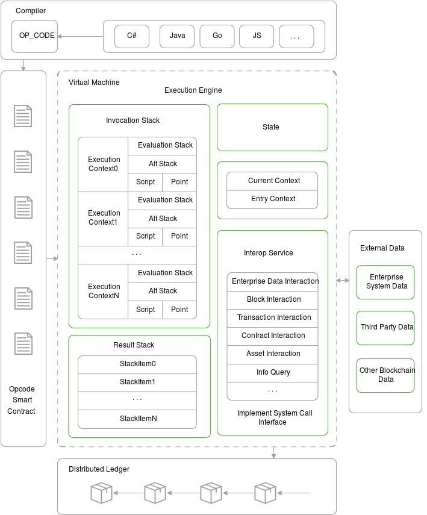

# NeoVM 虚拟机 
<!-- TOC -->

- [NeoVM 虚拟机](#neovm-虚拟机)
    - [NEO3变更部分](#neo3变更部分)
    - [NeoVM 架构原理](#neovm-架构原理)
        - [执行引擎](#执行引擎)
        - [存储器](#存储器)
    - [互操作接口](#互操作接口)
    - [内置数据类型](#内置数据类型)
    - [指令集](#指令集)
        - [常数](#常数)
            - [PUSHINT](#pushint)
            - [PUSHA](#pusha)
            - [PUSHNULL](#pushnull)
            - [PUSHDATA](#pushdata)
            - [PUSHM1](#pushm1)
            - [PUSHN](#pushn)
        - [流程控制](#流程控制)
            - [NOP](#nop)
            - [JMP](#jmp)
            - [JMP_L](#jmp_l)
            - [JMPIF](#jmpif)
            - [JMPIF_L](#jmpif_l)
            - [JMPIFNOT](#jmpifnot)
            - [JMPIFNOT_L](#jmpifnot_l)
            - [JMPEQ](#jmpeq)
            - [JMPEQ_L](#jmpeq_l)
            - [JMPNE](#jmpne)
            - [JMPNE_L](#jmpne_l)
            - [JMPGT](#jmpgt)
            - [JMPGT_L](#jmpgt_l)
            - [JMPGE](#jmpge)
            - [JMPGE_L](#jmpge_l)
            - [JMPLT](#jmplt)
            - [JMPLT_L](#jmplt_l)
            - [JMPLE](#jmple)
            - [JMPLE_L](#jmple_l)
            - [CALL](#call)
            - [CALL_L](#call_l)
            - [CALLA](#calla)
            - [THROW](#throw)
            - [THROWIF](#throwif)
            - [THROWIFNOT](#throwifnot)
            - [RET](#ret)
            - [SYSCALL](#syscall)
        - [栈操作](#栈操作)
            - [DEPTH](#depth)
            - [DROP](#drop)
            - [NIP](#nip)
            - [XDROP](#xdrop)
            - [CLEAR](#clear)
            - [DUP](#dup)
            - [OVER](#over)
            - [PICK](#pick)
            - [TUCK](#tuck)
            - [SWAP](#swap)
            - [ROT](#rot)
            - [ROLL](#roll)
            - [REVERSE3](#reverse3)
            - [REVERSE4](#reverse4)
            - [REVERSEN](#reversen)
        - [槽操作](#槽操作)
            - [INITSSLOT](#initsslot)
            - [INITSLOT](#initslot)
            - [LDSFLDN](#ldsfldn)
            - [LDSFLD](#ldsfld)
            - [STSFLDN](#stsfldn)
            - [STSFLD](#stsfld)
            - [LDLOCN](#ldlocn)
            - [LDLOC](#ldloc)
            - [STLOCN](#stlocn)
            - [STLOC](#stloc)
            - [LDARGN](#ldargn)
            - [LDARG](#ldarg)
            - [STARGN](#stargn)
            - [STARG](#starg)
        - [字符串操作](#字符串操作)
            - [NEWBUFFER](#newbuffer)
            - [MEMCPY](#memcpy)
            - [CAT](#cat)
            - [SUBSTR](#substr)
            - [LEFT](#left)
            - [RIGHT](#right)
        - [逻辑运算](#逻辑运算)
            - [INVERT](#invert)
            - [AND](#and)
            - [OR](#or)
            - [XOR](#xor)
            - [EQUAL](#equal)
            - [NOTEQUAL](#notequal)
        - [算术运算](#算术运算)
            - [SIGN](#sign)
            - [ABS](#abs)
            - [NEGATE](#negate)
            - [INC](#inc)
            - [DEC](#dec)
            - [ADD](#add)
            - [SUB](#sub)
            - [MUL](#mul)
            - [DIV](#div)
            - [MOD](#mod)
            - [SHL](#shl)
            - [SHR](#shr)
            - [NOT](#not)
            - [BOOLAND](#booland)
            - [BOOLOR](#boolor)
            - [NZ](#nz)
            - [NUMEQUAL](#numequal)
            - [NUMNOTEQUAL](#numnotequal)
            - [LT](#lt)
            - [LE](#le)
            - [GT](#gt)
            - [GE](#ge)
            - [MIN](#min)
            - [MAX](#max)
            - [WITHIN](#within)
        - [高级数据结构](#高级数据结构)
            - [PACK](#pack)
            - [UNPACK](#unpack)
            - [NEWARRAY0](#newarray0)
            - [NEWARRAY](#newarray)
            - [NEWARRAY_T](#newarray_t)
            - [NEWSTRUCT0](#newstruct0)
            - [NEWSTRUCT](#newstruct)
            - [NEWMAP](#newmap)
            - [SIZE](#size)
            - [HASKEY](#haskey)
            - [KEYS](#keys)
            - [VALUES](#values)
            - [PICKITEM](#pickitem)
            - [APPEND*](#append)
            - [SETITEM*](#setitem)
            - [REVERSEITEMS](#reverseitems)
            - [REMOVE*](#remove)
            - [CLEARITEMS](#clearitems)
        - [类型操作](#类型操作)
            - [ISNULL](#isnull)
            - [ISTYPE](#istype)
            - [CONVERT](#convert)

<!-- /TOC -->

NeoVM 是执行 Neo 智能合约代码的虚拟机。本文所讲述的虚拟机概念比较狭义，并非是借助于操作系统对物理机器的一种模拟，与 vmware 或者 Hyper-V 不同，主要是针对具体语言所实现的虚拟机。

例如在 Java 的 JVM 或者 .Net 的 CLR 中，Java 或者 .Net 源码会被编译成相关的字节码，然后在对应虚拟机上运行， JVM 或 CLR 会对这些字节码进行取指令、译码、执行、结果回写等操作。这些步骤和真实物理机器上的概念都很相似。相对应的二进制指令仍然是在物理机器上运行，物理机器从内存中取指令，通过总线传输到 CPU，然后译码、执行、结果存储。

## NEO3变更部分

- 新增
    - `PUSHINT`, `JMP_L`, `JMPIF_L`, `JMPIFNOT_L`, `JMPEQ`, `JMPEQ_L`, `JMPNE`, `JMPNE_L`, `JMPGT`, `JMPGT_L`, 
    `JMPGE`, `JMPGE_L`, `JMPLT`, `JMPLT_L`, `JMPLE`, `JMPLE_L`, `CALL_L`, `CALLA`, `THROWIF`, `CLEAR`, `REVERSE3`, `REVERSE4`, `REVERSEN`, [槽操作](#槽操作), `NEWBUFFER`, `MEMCPY`, `NOTEQUAL`, `LE`, `GE`, `NEWARRAY0`, `NEWARRAY_T`, `NEWSTRUCT0`, `REVERSEITEMS`, `CLEARITEMS`, `ISNULL`, `ISTYPE`, `CONVERT`        
- 删除
    - `PUSHF`, `PUSHBYTES1`, `PUSHBYTES75`, `APPCALL`, `TAILCALL`, `XTUCK`, `XSWAP`, `FROMALTSTACK`, `TOALTSTACK`, `DUPFROMALTSTACK`, `SIZE`, `LTE`, `GTE`, `SHA1`, `SHA256`, `HASH160`, `HASH256`, `CHECKSIG`, `VERIFY`, `CHECKMULTISIG`, `ARRAYSIZE`, `CALL_I`, `CALL_E`, `CALL_ED`, `CALL_ET`, `CALL_EDT`
## NeoVM 架构原理


上图是NEO虚拟机的系统架构图，其主要由执行引擎、存储器、互操作接口等部分构成。

一个完整的运行流程如下：
1. 将编写好的C#、Java等智能合约源码通过编译器编译成字节码。

2. 将字节码以及相关参数等作为一个运行上下文压入调用栈中。

3. 执行引擎每次会根据当前上下文取出需要执行的操作码，然后针对不同的操作码去执行对应的操作，执行过程的数据将会存储在当前上下文的计算栈和临时栈。

4. 如果需要访问外部数据等时，调用互操作接口。

5. 所有脚本执行完后，将运行结果保存在结果栈中。

### 执行引擎

左侧部分是虚拟机执行引擎（相当于 CPU），它可以执行常见的指令，例如流程控制、栈操作、位操作、算数运算、逻辑运算、密码学方法等，还可以通过系统调用，与互操作服务层进行交互。虚拟机执行引擎具体支持的指令集将会在下文进行详细介绍。
NeoVM一共有四种状态，分别为 `NONE`、`HALT`、`FAULT`、`BREAK`。

- `NONE` 为正常状态。

- `HALT` 为停止状态，当调用栈为空，即所有脚本执行完毕后，会将虚拟机状态置为HALT。

- `FAULT` 为错误状态，当指令操作出错时会将虚拟机状态置为FAULT。

- `BREAK` 为中断状态，一般用于智能合约的调试过程中。

每次虚拟机启动时，执行引擎首先会检测虚拟机状态，只有当虚拟机状态为NONE时，才能开始运行。
### 存储器
NeoVM中一共有四种存储器，调用栈（InvocationStack）、计算栈（EvaluationStack）、临时栈（AltStack）和结果栈（ReaultStack）。
系统架构如图中所示：

- 调用栈，用于保存当前虚拟机的所有执行上下文（ExecutionContext），不同的上下文之间实现栈隔离。上下文切换依靠当前上下文（CurrentContext）和入口上下文（EntryContext）来完成。其中当前上下文指向调用栈的栈顶元素，在系统架构图中对应 ExecutionContext0，入口上下文指向调用栈的栈底元素，在图中对应ExecutionContextN。
- 计算栈，用于保存指令在相应执行过程中所用到的数据，每个执行上下文都有自己独立的计算栈；
- 临时栈，用于保存指令在相应执行过程中所用到的临时数据，每个执行上下文都有自己独立的临时栈；
- 结果栈，保存所有脚本执行完后产生的执行结果。


## 互操作接口

右侧部分是虚拟机的互操作服务层（相当于外设）。目前互操作服务层提供了智能合约所能访问区块链数据的一些 API，利用这些 API，可以访问区块信息、交易信息、合约信息、资产信息等。

除此之外互操作服务层还为每个合约提供了一个持久化存储区的功能。Neo 的每个智能合约在创建的时候都可选地启用一个私有存储区，存储区是 key-value 形式的，Neo 智能合约由合约的被调用者决定持久化存储区的上下文，而非调用者来决定。当然，调用者需要将自己的存储上下文传给被调用者（即完成授权）后，被调用者才可以执行读写操作。

关于互操作服务的详细介绍在智能合约部分。

## 内置数据类型

NeoVM内置的数据类型一共有7种：


| 类型 | 描述 |
|------|------|
| Boolean |  布尔类型，实现为一个bool值和两个字节数组TRUE和FALSE。|
| Integer | 整型，实现为一个BigInteger值。 |
| ByteArray | 字节数组，实现为一个byte[]。  |
| Array |  数组，实现为一个List<StackItem\>，StackItem是一个抽象类，NeoVM内置的数据类型均继承自StackItem。 |
| Struct | 结构体，继承自Array。结构与Array相同，只是添加了Clone方法和重写了Equals方法。 |
| Map |  实现为一个键值对为StackItem的字典类型Dictionary<StackItem, StackItem> 。 |
| InteropInterface |  互操作接口 |


```c#
// boolean 类型
private static readonly byte[] TRUE = { 1 };
private static readonly byte[] FALSE = new byte[0];

private bool value;
```

## 指令集
NeoVM虚拟机一共实现了184个指令，类别如下：

| 常数 | 流程控制 | 栈操作 | 槽操作 |字符串操作 | 逻辑运算 | 算术运算 | 高级数据结构 | 类型操作 |
| ---- | -------- | ------ | ------ | -------- | -------- | -------- | ---- | ---- |
| 29 | 32 | 15 | 50 | 6 | 6 | 25 | 18 | 3|

下面将分别介绍各个指令的详细内容。
### 常数
常数部分指令主要完成向计算栈中压入常数或者数组的功能。

#### PUSHINT

| 指令：   | PUSHINT8, PUSHINT16, PUSHINT32, PUSHINT64, PUSHINT128, PUSHINT256                                   |
|----------|---------------------------------------|
| 字节码： | 0x00, 0x01, 0x02, 0x03, 0x04, 0x05                                                  |
| 系统费： | 0.00000030 GAS, 0.00000030 GAS, 0.00000030 GAS, 0.00000030 GAS, 0.00000120 GAS, 0.00000120 GAS                     |
| 功能：   | 向计算栈中压入一个整数，其位长度由本指令后的 8\16\32\64\128\256指定。 |

#### PUSHA

| 指令   | PUSHA                                 |
|----------|----------|
| 字节码： | 0x0A                                  |
| 系统费： | 0.00000120 GAS                           |
| 功能： | 将接下来的四个字节转换为地址，并将该地址压入计算栈 |

#### PUSHNULL

| 指令：   | PUSHNULL                                   |
|----------|------------------------------------------|
| 字节码： | 0x0B                                     |
| 系统费: | 0.00000030 GAS                               |
| 功能：   | 向计算栈中压入NULL值。 |

#### PUSHDATA

| 指令：   | PUSHDATA1, PUSHDATA2, PUSHDATA4                                   |
|----------|---------------------------------------|
| 字节码： | 0x0C, 0x0D, 0x0E                                                  |
| 系统费： | 0.00000180 GAS, 0.00013000 GAS, 0.00110000 GAS                    |
| 功能：   | 向计算栈中压入一个字节数组，其长度由本指令后的 1\|2\|4 字节指定。 |

#### PUSHM1

| 指令：   | PUSHM1                                   |
|----------|------------------------------------------|
| 字节码： | 0x0F                                     |
| 系统费： | 0.00000030 GAS                             |
| 功能：   | 向计算栈中压入一个整数，其数值等于-1。 |

#### PUSHN

| 指令：   | PUSH1\~PUSH16                               |
|----------|---------------------------------------------|
| 字节码： | 0x11\~0x20                                  |
| 系统费： | 0.00000030 GAS                                      |
| 功能：   | 向计算栈中压入一个整数，其数值等于1\~16。 |

### 流程控制
用于控制的虚拟机运行流程，包括跳转、调用等指令。

#### NOP

| 指令：   | NOP                                         |
|----------|---------------------------------------------|
| 字节码： | 0x21                                        |
| 系统费： | 0.00000030 GAS                                |
| 功能：   | 空操作，但是会使指令计步器加1。 |

#### JMP

| 指令：   | JMP                                                     |
|----------|---------------------------------------------------------|
| 字节码： | 0x22                                                    |
| 系统费： | 0.00000070 GAS                                            |
| 功能：   | 无条件跳转到指定偏移位置，偏移量由本指令后的1字节指定。 |

#### JMP_L

| 指令：   | JMP_L                                                     |
|----------|---------------------------------------------------------|
| 字节码： | 0x23                                                    |
| 系统费： | 0.00000070 GAS                                            |
| 功能：   | 无条件跳转到指定偏移位置。偏移量由本指令后的4字节指定。 |

#### JMPIF

| 指令：   | JMPIF                                                                                                                |
|----------|----------------------------------------------------------------------------------------------------------------------|
| 字节码： | 0x24                                                                                                                 |
| 系统费： | 0.00000070 GAS                                                                                                         |
| 功能：   | 当计算栈栈顶元素为true，而不等于0或null时，跳转到指定偏移位置，</br>偏移量由本指令后的1字节指定。

#### JMPIF_L

| 指令：   | JMPIF                                                                                                                |
|----------|----------------------------------------------------------------------------------------------------------------------|
| 字节码： | 0x25                                                                                                                 |
| 系统费： | 0.00000070 GAS                                                                                                         |
| 功能：   | 当计算栈栈顶元素为true，而不等于0或null时，跳转到指定偏移位置，</br>偏移量由本指令后的4字节指定。 |

#### JMPIFNOT

| 指令：   | JMPIFNOT                                                           |
|----------|--------------------------------------------------------------------|
| 字节码： | 0x26                                                               |
| 系统费： | 0.00000070 GAS                                                        |
| 功能：   | 当计算栈栈顶元素为false、0或者null时，跳转到指定偏移位置，偏移量由本指令后的1字节指定 |

#### JMPIFNOT_L

| 指令：   | JMPIFNOT_L                                                           |
|----------|--------------------------------------------------------------------|
| 字节码： | 0x27                                                               |
| 系统费： | 0.00000070 GAS                                                        |
| 功能：   | 当计算栈栈顶元素为false、0或者null时，跳转到指定偏移位置，偏移量由本指令后的4字节指定 |

#### JMPEQ

| 指令：   | JMPEQ                                                           |
|----------|--------------------------------------------------------------------|
| 字节码： | 0x28                                                               |
| 系统费： | 0.00000070 GAS                                                        |
| 功能：   | 当栈顶两个元素相等时，跳转到指定偏移位置，偏移量由本指令后的1字节指定 |

#### JMPEQ_L

| 指令：   | JMPEQ_L                                                           |
|----------|--------------------------------------------------------------------|
| 字节码： | 0x29                                                               |
| 系统费： | 0.00000070 GAS                                                        |
| 功能：   | 当栈顶两个元素相等时，跳转到指定偏移位置，偏移量由本指令后的4字节指定 |

#### JMPNE

| 指令：   | JMPNE                                                           |
|----------|--------------------------------------------------------------------|
| 字节码： | 0x2A                                                               |
| 系统费： | 0.00000070 GAS                                                        |
| 功能：   | 当栈顶两个元素不相等时，跳转到指定偏移位置，偏移量由本指令后的1字节指定 |

#### JMPNE_L

| 指令：   | JMPNE_L                                                           |
|----------|--------------------------------------------------------------------|
| 字节码： | 0x2B                                                               |
| 系统费： | 0.00000070 GAS                                                        |
| 功能：   | 当栈顶两个元素不相等时，跳转到指定偏移位置，偏移量由本指令后的4字节指定 |

#### JMPGT

| 指令：   | JMPGT                                                           |
|----------|--------------------------------------------------------------------|
| 字节码： | 0x2C                                                               |
| 系统费： | 0.00000070 GAS                                                        |
| 功能：   | 当计算栈栈顶第一个元素大于第二个元素时，跳转到指定偏移位置，偏移量由本指令后的1字节指定 |

#### JMPGT_L

| 指令：   | JMPGT_L                                                           |
|----------|--------------------------------------------------------------------|
| 字节码： | 0x2D                                                               |
| 系统费： | 0.00000070 GAS                                                        |
| 功能：   | 当计算栈栈顶第一个元素大于第二个元素时，跳转到指定偏移位置，偏移量由本指令后的4字节指定 |

#### JMPGE

| 指令：   | JMPGE                                                           |
|----------|--------------------------------------------------------------------|
| 字节码： | 0x2E                                                               |
| 系统费： | 0.00000070 GAS                                                        |
| 功能：   | 当计算栈栈顶第一个元素大于或者等于第二个元素时，跳转到指定偏移位置，偏移量由本指令后的1字节指定 |

#### JMPGE_L

| 指令：   | JMPGE_L                                                           |
|----------|--------------------------------------------------------------------|
| 字节码： | 0x2F                                                               |
| 系统费： | 0.00000070 GAS                                                        |
| 功能：   | 当计算栈栈顶第一个元素大于第二个元素时，跳转到指定偏移位置，偏移量由本指令后的4字节指定 |

#### JMPLT

| 指令：   | JMPLT                                                           |
|----------|--------------------------------------------------------------------|
| 字节码： | 0x30                                                               |
| 系统费： | 0.00000070 GAS                                                        |
| 功能：   | 当计算栈栈顶第一个元素小于第二个元素时，跳转到指定偏移位置，偏移量由本指令后的1字节指定 |

#### JMPLT_L

| 指令：   | JMPLT_L                                                           |
|----------|--------------------------------------------------------------------|
| 字节码： | 0x31                                                               |
| 系统费： | 0.00000070 GAS                                                        |
| 功能：   | 当计算栈栈顶第一个元素小于第二个元素时，跳转到指定偏移位置，偏移量由本指令后的4字节指定 |

#### JMPLE

| 指令：   | JMPLE                                                           |
|----------|--------------------------------------------------------------------|
| 字节码： | 0x32                                                               |
| 系统费： | 0.00000070 GAS                                                        |
| 功能：   | 当计算栈栈顶第一个元素小于或者等于第二个元素时，跳转到指定偏移位置，偏移量由本指令后的1字节指定 |

#### JMPLE_L

| 指令：   | JMPLE_L                                                           |
|----------|--------------------------------------------------------------------|
| 字节码： | 0x33                                                               |
| 系统费： | 0.00000070 GAS                                                        |
| 功能：   | 当计算栈栈顶第一个元素小于或者等于第二个元素时，跳转到指定偏移位置，偏移量由本指令后的4字节指定 |

#### CALL

| 指令：   | CALL                                                  |
|----------|-------------------------------------------------------|
| 字节码： | 0x34                                                  |
| 系统费： | 0.00022000 GAS                           |
| 功能：   | 调用指定偏移位置的函数，偏移量由本指令后的1字节指定。 |

#### CALL_L

| 指令：   | CALL_L                                                  |
|----------|-------------------------------------------------------|
| 字节码： | 0x65                                                  |
| 系统费： | 0.00022000 GAS                           |
| 功能：   | 调用指定偏移位置的函数，偏移量由本指令后的4字节指定。 |

#### CALLA

| 指令：   | CALLA                                                  |
|----------|-------------------------------------------------------|
| 字节码： | 0x36                                                  |
| 系统费： | 0.00022000 GAS                           |
| 功能：   | 从计算栈栈顶取出函数地址，并调用该函数 |

#### THROW

| 指令：   | THROW                 |
|----------|-----------------------|
| 字节码： | 0x37                  |
| 系统费： | 0.0000003 GAS                                                        |
| 功能：   | 将虚拟机状态置为FAULT |

#### THROWIF

| 指令：   | THROWIF                                                  |
|----------|-------------------------------------------------------|
| 字节码： | 0x38                                                  |
| 系统费： | 0.0000003 GAS                           |
| 功能：   | 从计算栈栈顶读取一个布尔值，如果为True，则将虚拟机状态置为FAULT |

#### THROWIFNOT

| 指令：   | THROWIFNOT                                                       |
|----------|------------------------------------------------------------------|
| 字节码： | 0x39                                                             |
| 系统费： | 0.0000003 GAS                                                        |
| 功能：   | 从计算栈栈顶读取一个布尔值，如果为False，则将虚拟机状态置为FAULT |

#### RET

| 指令：   | RET                                                                                              |
|----------|--------------------------------------------------------------------------------------------------|
| 字节码： | 0x40                                                                                             |
| 系统费： | 0 GAS                                                        |
| 功能：   | 从当前方法中返回 |

#### SYSCALL

| 指令：   | SYSCALL                                                |
|----------|--------------------------------------------------------|
| 字节码： | 0x41                                                   |
| 系统费： | 0 GAS                                                        |
| 功能：   | 调用互操作服务 |

### 栈操作
实现对栈的元素做复制、移除、交换等功能。

#### DEPTH
| 指令   | DEPTH                          |
|----------|------------------------------------------|
| 字节码： | 0x43                                     |
| 系统费： | 0.00000060 GAS                                                        |
| 功能： | 将栈元素个数压入计算栈。 |

#### DROP

| 指令：   | DROP                   |
|----------|------------------------|
| 字节码： | 0x45                   |
| 系统费： | 0.00000060 GAS                                                        |
| 功能：   | 移除计算栈栈顶的元素。 |

#### NIP

| 指令：   | NIP                               |
|----------|------------------------------------------|
| 字节码： | 0x46                                     |
| 系统费： | 0.00000060 GAS                                                        |
| 功能：   | 移除计算栈栈顶的第二个元素。 |

#### XDROP

| 指令：   | XDROP                                              |
|----------|----------------------------------------------------|
| 字节码： | 0x48                                               |
| 系统费： | 0.00000400 GAS                                                        |
| 功能：   | 移除计算栈栈顶的元素n，并移除剩余的索引为n的元素。 |
| 输入：   | Xn Xn-1 ... X2 X1 X0 n                             |
| 输出：   | Xn-1 ... X2 X1 X0                                  |

#### CLEAR

| 指令：   | CLEAR                             |
|----------|------------------------------------------|
| 字节码： | 0x49                                     |
| 系统费: | 0.00000400 GAS                               |
| 功能：   | 清空计算栈 |

#### DUP

| 指令：   | DUP                    |
|----------|------------------------|
| 字节码： | 0x4A                   |
| 系统费： | 0.00000060 GAS                                                        |
| 功能：   | 复制计算栈栈顶的元素。 |
| 输入：   | X                      |
| 输出：   | X X                    |

#### OVER

| 指令：   | OVER                    |
|----------|------------------------|
| 字节码： | 0x4B                   |
| 系统费： | 0.00000060 GAS                                                        |
| 功能：   | 复制计算栈栈顶的第二个元素，并压入栈顶 |
| 输入：   | X1 X0                      |
| 输出：   | X1 X0 X1                   |

#### PICK

| 指令：   | PICK                    |
|----------|------------------------|
| 字节码： | 0x4D                   |
| 系统费： | 0.00000060 GAS                                                        |
| 功能：   | 移除计算栈栈顶的元素n，并将剩余的索引为n的元素复制到栈顶。 |
| 输入：   | Xn Xn-1 ... X2 X1 X0 n                      |
| 输出：   |Xn Xn-1 ... X2 X1 X0 Xn                   |

#### TUCK

| 指令：   | TUCK                    |
|----------|------------------------|
| 字节码： | 0x4E                   |
| 系统费： | 0.00000060 GAS                                                        |
| 功能：   | 复制计算栈栈顶的元素到索引为2的位置。 |
| 输入：   | X1 X0                      |
| 输出：   | X0 X1 X0                    |

#### SWAP

| 指令：   | SWAP                    |
|----------|------------------------|
| 字节码： | 0x50                   |
| 系统费： | 0.00000060 GAS                                                        |
| 功能：   | 交换计算栈栈顶两个元素的位置。 |
| 输入：   | X0 X1                      |
| 输出：   | X1 X0                    |

#### ROT

| 指令：   | ROT                    |
|----------|------------------------|
| 字节码： | 0x51                   |
| 系统费： | 0.00000060 GAS                                                        |
| 功能：   | 移除计算栈栈顶的第3个元素，并将其压入栈顶。 |
| 输入：   | X2 X1 X0                      |
| 输出：   | X1 X0 X2                    |

#### ROLL

| 指令：   | ROLL                    |
|----------|------------------------|
| 字节码： | 0x52                   |
| 系统费： | 0.00000400 GAS                                                        |
| 功能：   | 移除计算栈栈顶的元素n，并将剩余的索引为n的元素移动到栈顶。 |
| 输入：   | Xn Xn-1 ... X2 X1 X0 n                      |
| 输出：   | Xn-1 ... X2 X1 X0 Xn                    |

#### REVERSE3

| 指令：   | REVERSE3                    |
|----------|------------------------|
| 字节码： | 0x53                   |
| 系统费： | 0.00000060 GAS                                                        |
| 功能：   | 反转计算栈栈顶前三个元素的顺序。 |
| 输入：   | X0 X1 X2                      |
| 输出：   | X2 X1 X0                   |

#### REVERSE4

| 指令：   | REVERSE4                    |
|----------|------------------------|
| 字节码： | 0x54                   |
| 系统费： | 0.00000060 GAS                                                        |
| 功能：   | 反转计算栈栈顶前四个元素的顺序。 |
| 输入：   | X0 X1 X2 X3                     |
| 输出：   | X3 X2 X1 X0                    |

#### REVERSEN

| 指令：   | REVERSEN                    |
|----------|------------------------|
| 字节码： | 0x55                   |
| 系统费： | 0.00000400 GAS                                                        |
| 功能：   | 移除计算栈栈顶元素n，并反转之后n个元素的顺序。 |
| 输入：   | Xn-1 ... X2 X1 X0 n                      |
| 输出：   | X0 X1 X2 ... Xn-1                    |

### 槽操作

#### INITSSLOT

| 指令：   | INITSSLOT                                  |
|----------|---------------------------------------|
| 字节码： | 0x56                                  |
| 系统费： | 0.00000400 GAS                                                        |
| 功能：   | 初始化当前执行上下文的静态字段列表。 |

#### INITSLOT

| 指令：   | INITSLOT                                  |
|----------|---------------------------------------|
| 字节码： | 0x57                                  |
| 系统费： | 0.00000800 GAS                                                        |
| 功能：   | 初始化当前执行上下文的参数槽和局部变量列表。 |

#### LDSFLDN

| 指令：   | LDSFLD0\~LDSFLD6                                  |
|----------|---------------------------------------|
| 字节码： | 0x58\~0x5E                                  |
| 系统费： | 0.00000060 GAS                                                        |
| 功能：   | 将指定索引处的静态字段压入计算堆栈，索引值为0\~6。 |

#### LDSFLD

| 指令：   | LDSFLD                                  |
|----------|---------------------------------------|
| 字节码： | 0x5F                                  |
| 系统费： | 0.00000060 GAS                                                        |
| 功能：   | 将指定索引处的静态字段压入计算堆栈。索引表示为1字节的无符号整数。 |

#### STSFLDN

| 指令：   | STSFLD0\~STSFLD6                                  |
|----------|---------------------------------------|
| 字节码： | 0x60\~0x0x66                                  |
| 系统费： | 0.0000006 GAS                                                        |
| 功能：   | 将计算栈栈顶元素存入静态列表的指定索引处，索引值为0\~6。 |

#### STSFLD

| 指令：   | STSFLD                                  |
|----------|---------------------------------------|
| 字节码： | 0x67                                  |
| 系统费： | 0.00000060 GAS                                                        |
| 功能：   | 将计算栈栈顶元素存入静态列表的指定索引处。索引表示为1字节的无符号整数。 |

#### LDLOCN

| 指令：   | LDLOC0\~LDLOC6                                  |
|----------|---------------------------------------|
| 字节码： | 0x68\~0x6E                                  |
| 系统费： | 0.00000060 GAS                                                        |
| 功能：   | 将指定索引处的局部变量压入计算堆栈，索引值为0\~6。 |

#### LDLOC

| 指令：   | LDLOC                                  |
|----------|---------------------------------------|
| 字节码： | 0x6F                                  |
| 系统费： | 0.00000060 GAS                                                        |
| 功能：   | 将指定索引处的局部变量压入计算堆栈。索引表示为1字节的无符号整数。 |

#### STLOCN

| 指令：   | STLOC0\~STLOC6                                  |
|----------|---------------------------------------|
| 字节码： | 0x70\~0x76                                  |
| 系统费： | 0.00000060 GAS                                                        |
| 功能：   | 将计算栈栈顶元素存入局部变量表的指定索引处，索引值为0\~6。 |

#### STLOC

| 指令：   | STLOC                                  |
|----------|---------------------------------------|
| 字节码： | 0x77                                  |
| 系统费： | 0.00000060 GAS                                                        |
| 功能：   | 将计算栈栈顶元素存入局部变量表的指定索引处。索引表示为1字节的无符号整数。 |

#### LDARGN

| 指令：   | LDARG0\~LDARG6                                  |
|----------|---------------------------------------|
| 字节码： | 0x78\~0x7E                                  |
| 系统费： | 0.00000060 GAS                                                        |
| 功能：   | 将指定索引处的参数压入计算堆栈，索引值为0\~6。 |

#### LDARG

| 指令：   | LDARG                                  |
|----------|---------------------------------------|
| 字节码： | 0x7F                                  |
| 系统费： | 0.00000060 GAS                                                        |
| 功能：   | 将指定索引处的参数压入计算堆栈。索引表示为1字节的无符号整数。 |

#### STARGN

| 指令：   | STARG0\~STARG6                                  |
|----------|---------------------------------------|
| 字节码： | 0x80\~0x86                                |
| 系统费： | 0.00000060 GAS                                                        |
| 功能：   | 将计算栈栈顶元素存入参数槽的指定索引处，索引值为0\~6。 |

#### STARG

| 指令：   | STARG                                 |
|----------|---------------------------------------|
| 字节码： | 0x87                                  |
| 系统费： | 0.00000060 GAS                                                        |
| 功能：   | 将计算栈栈顶元素存入参数槽的指定索引处。索引表示为1字节的无符号整数。 |

### 字符串操作

#### NEWBUFFER

| 指令：   | NEWBUFFER                                              |
|----------|--------------------------------------------------|
| 字节码： | 0x88                                             |
| 系统费： | 0.00080000  GAS                                                        |
| 功能：   | 创建缓冲区 |

#### MEMCPY

| 指令：   | MEMCPY                                              |
|----------|--------------------------------------------------|
| 字节码： | 0x89                                             |
| 系统费： | 0.00080000  GAS                                                        |
| 功能：   | 内存复制 |

#### CAT

| 指令：   | CAT                                              |
|----------|--------------------------------------------------|
| 字节码： | 0x8B                                             |
| 系统费： | 0.00080000  GAS                                                        |
| 功能：   | 拼接两个字符串 |

#### SUBSTR

| 指令：   | SUBSTR                                       |
|----------|----------------------------------------------|
| 字节码： | 0x8C                                         |
| 系统费： | 0.00080000 GAS                                                        |
| 功能：   | 返回子字符串。 |

#### LEFT

| 指令：   | LEFT                                         |
|----------|----------------------------------------------|
| 字节码： | 0x8D                                         |
| 系统费： | 0.00080000 GAS                                                        |
| 功能：   | 移除计算栈栈顶的两个元素，取子串后压入栈顶。 |
| 输入：   | X len                                        |
| 输出：   | SubString(X,0,len)                                  |

#### RIGHT

| 指令：   | RIGHT                                        |
|----------|----------------------------------------------|
| 字节码： | 0x8E                                         |
| 系统费： | 0.00080000 GAS                                                        |
| 功能：   | 移除计算栈栈顶的两个元素，取子串后压入栈顶。 |
| 输入：   | X len                                        |
| 输出：   | SubString(X,X.Length - len,len)                                 |

### 逻辑运算

#### INVERT

| 指令：   | INVERT                       |
|----------|------------------------------|
| 字节码： | 0x90                         |
| 系统费： | 0.00000100 GAS                                                        |
| 功能：   | 对计算栈栈顶的元素按位取反。 |
| 输入：   | X                            |
| 输出：   | \~X                          |

#### AND

| 指令：   | AND                                    |
|----------|----------------------------------------|
| 字节码： | 0x91                                   |
| 系统费： | 0.00000200 GAS                                                        |
| 功能：   | 对计算栈栈顶的两个元素执行按位与运算。 |
| 输入：   | AB                                     |
| 输出：   | A&B                                    |

#### OR

| 指令：   | OR                                     |
|----------|----------------------------------------|
| 字节码： | 0x92                                   |
| 系统费： | 0.00000200 GAS                                                        |
| 功能：   | 对计算栈栈顶的两个元素执行按位或运算。 |
| 输入：   | AB                                     |
| 输出：   | A\|B                                   |

#### XOR

| 指令：   | XOR                                      |
|----------|------------------------------------------|
| 字节码： | 0x93                                     |
| 系统费： | 0.00000200 GAS                                                        |
| 功能：   | 对计算栈栈顶的两个元素执行按位异或运算。 |
| 输入：   | AB                                       |
| 输出：   | A\^B                                     |

#### EQUAL

| 指令：   | EQUAL                                        |
|----------|----------------------------------------------|
| 字节码： | 0x97                                         |
| 系统费： | 0.00000200 GAS                                                        |
| 功能：   | 逐位判断输入是否相等。若相等，则返回1，否则返回0。 |

#### NOTEQUAL

| 指令：   | NOTEQUAL                                        |
|----------|----------------------------------------------|
| 字节码： | 0x98                                         |
| 系统费： | 0.00000200 GAS                                                        |
| 功能：   | 逐位判断输入是否相等。若不相等，则返回1，否则返回0。 |

### 算术运算

#### SIGN

| 指令：   | SIGN                                         |
|----------|----------------------------------------------|
| 字节码： | 0x99                                         |
| 系统费： | 0.00000100 GAS                                                        |
| 功能：   | 获取计算栈栈顶的大整数的符号（负、正或零）。 |
| 输入：   | X                                            |
| 输出：   | X.Sign()                                     |

#### ABS

| 指令：   | ABS                            |
|----------|--------------------------------|
| 字节码： | 0x9A                           |
| 系统费： | 0.00000100 GAS                                                        |
| 功能：   | 求计算栈栈顶的大整数的绝对值。 |
| 输入：   | X                              |
| 输出：   | Abs(X)                         |

#### NEGATE

| 指令：   | NEGATE                         |
|----------|--------------------------------|
| 字节码： | 0x9B                           |
| 系统费： | 0.00000100 GAS                                                        |
| 功能：   | 求计算栈栈顶的大整数的相反数。 |
| 输入：   | X                              |
| 输出：   | \-X                            |

#### INC

| 指令：   | INC                                |
|----------|------------------------------------|
| 字节码： | 0x9C                               |
| 系统费： | 0.00000100 GAS                                                        |
| 功能：   | 对计算栈栈顶的大整数执行递增运算。 |
| 输入：   | X                                  |
| 输出：   | X+1                                |

#### DEC

| 指令：   | DEC                                |
|----------|------------------------------------|
| 字节码： | 0x9D                               |
| 系统费： | 0.00000100 GAS                                                        |
| 功能：   | 对计算栈栈顶的大整数执行递减运算。 |
| 输入：   | X                                  |
| 输出：   | X-1                                |

#### ADD

| 指令：   | ADD                                    |
|----------|----------------------------------------|
| 字节码： | 0x9E                                   |
| 系统费： | 0.00000200 GAS                                                        |
| 功能：   | 对计算栈栈顶的两个大整数执行加法运算。 |
| 输入：   | AB                                     |
| 输出：   | A+B                                    |

#### SUB

| 指令：   | SUB                                    |
|----------|----------------------------------------|
| 字节码： | 0x9F                                  |
| 系统费： | 0.00000200 GAS                                                        |
| 功能：   | 对计算栈栈顶的两个大整数执行减法运算。 |
| 输入：   | AB                                     |
| 输出：   | A-B                                    |

#### MUL

| 指令：   | MUL                                    |
|----------|----------------------------------------|
| 字节码： | 0xA0                                   |
| 系统费： | 0.00000300 GAS                                                        |
| 功能：   | 对计算栈栈顶的两个大整数执行乘法运算。 |
| 输入：   | AB                                     |
| 输出：   | A\*B                                   |

#### DIV

| 指令：   | DIV                                    |
|----------|----------------------------------------|
| 字节码： | 0xA1                                   |
| 系统费： | 0.00000300 GAS                                                        |
| 功能：   | 对计算栈栈顶的两个大整数执行除法运算。 |
| 输入：   | AB                                     |
| 输出：   | A/B                                    |

#### MOD

| 指令：   | MOD                                    |
|----------|----------------------------------------|
| 字节码： | 0xA2                                   |
| 系统费： | 0.00000300 GAS                                                        |
| 功能：   | 对计算栈栈顶的两个大整数执行求余运算。 |
| 输入：   | AB                                     |
| 输出：   | A%B                                    |

#### SHL

| 指令：   | SHL                              |
|----------|----------------------------------|
| 字节码： | 0xA8                             |
| 系统费： | 0.00000300 GAS                                                        |
| 功能：   | 对计算栈中的大整数执行左移运算。 |
| 指令：   | Xn                               |
| 字节码： | X\<\<n                           |

#### SHR

| 指令：   | SHR                              |
|----------|----------------------------------|
| 字节码： | 0xA9                             |
| 系统费： | 0.00000300 GAS                                                        |
| 功能：   | 对计算栈中的大整数执行右移运算。 |
| 输入：   | Xn                               |
| 输出：   | X\>\>n                           |

#### NOT

| 指令：   | NOT                                |
|----------|------------------------------------|
| 字节码： | 0xAA                               |
| 系统费： | 0.00000100 GAS                                                        |
| 功能：   | 对计算栈栈顶的元素执行逻辑非运算。 |
| 输入：   | X                                  |
| 输出：   | !X                                 |

#### BOOLAND

| 指令：   | BOOLAND                                |
|----------|----------------------------------------|
| 字节码： | 0xAB                                   |
| 系统费： | 0.00000200 GAS                                                        |
| 功能：   | 对计算栈栈顶的两个元素执行逻辑与运算。 |
| 输入：   | AB                                     |
| 输出：   | A&&B                                   |

#### BOOLOR

| 指令：   | BOOLOR                                 |
|----------|----------------------------------------|
| 字节码： | 0xAC                                   |
| 系统费： | 0.00000200 GAS                                                        |
| 功能：   | 对计算栈栈顶的两个元素执行逻辑或运算。 |
| 输入：   | AB                                     |
| 输出：   | A\|\|B                                 |

#### NZ

| 指令：   | NZ                                  |
|----------|-------------------------------------|
| 字节码： | 0xB1                                |
| 系统费： | 0.00000100 GAS                                                        |
| 功能：   | 判断计算栈栈顶的大整数是否为非0值。 |
| 输入：   | X                                   |
| 输出：   | X!=0                                |

#### NUMEQUAL

| 指令：   | NUMEQUAL                               |
|----------|----------------------------------------|
| 字节码： | 0xB3                                   |
| 系统费： | 0.00000200 GAS                                                        |
| 功能：   | 对计算栈栈顶的两个大整数执行相等判断。 |
| 输入：   | AB                                     |
| 输出：   | A==B                                   |

#### NUMNOTEQUAL

| 指令：   | NUMNOTEQUAL                              |
|----------|------------------------------------------|
| 字节码： | 0xB4                                     |
| 系统费： | 0.00000200 GAS                                                        |
| 功能：   | 对计算栈栈顶的两个大整数执行不相等判断。 |
| 输入：   | AB                                       |
| 输出：   | A!=B                                     |

#### LT 

| 指令：   | LT                                     |
|----------|----------------------------------------|
| 字节码： | 0xB5                                   |
| 系统费： | 0.00000200 GAS                                                        |
| 功能：   | 对计算栈栈顶的两个大整数执行小于判断。 |
| 输入：   | AB                                     |
| 输出：   | A\<B                                   |

#### LE

| 指令：   | LE                                        |
|----------|--------------------------------------------|
| 字节码： | 0xB6                                       |
| 系统费： | 0.00000200 GAS                                                        |
| 功能：   | 对计算栈栈顶的两个大整数执行小于等于判断。 |
| 输入：   | AB                                         |
| 输出：   | A\<=B                                      |

#### GT

| 指令：   | GT                                     |
|----------|----------------------------------------|
| 字节码： | 0xB7                                   |
| 系统费： | 0.00000200 GAS                                                        |
| 功能：   | 对计算栈栈顶的两个大整数执行大于判断。 |
| 输入：   | AB                                     |
| 输出：   | A\>B                                   |

#### GE

| 指令：   | GE                                        |
|----------|--------------------------------------------|
| 字节码： | 0xB8                                       |
| 系统费： | 0.00000200  GAS                                                        |
| 功能：   | 对计算栈栈顶的两个大整数执行大于等于判断。 |
| 输入：   | AB                                         |
| 输出：   | A\>=B                                      |

#### MIN

| 指令：   | MIN                                    |
|----------|----------------------------------------|
| 字节码： | 0xB9                                   |
| 系统费： | 0.00000200  GAS                                                        |
| 功能：   | 取出计算栈栈顶的两个大整数中的最小值。 |
| 输入：   | AB                                     |
| 输出：   | Min(A,B)                               |

#### MAX

| 指令：   | MAX                                    |
|----------|----------------------------------------|
| 字节码： | 0xBA                                   |
| 系统费： | 0.00000200  GAS                                                        |
| 功能：   | 取出计算栈栈顶的两个大整数中的最大值。 |
| 输入：   | AB                                     |
| 输出：   | Max(A,B)                               |

#### WITHIN

| 指令：   | WITHIN                                       |
|----------|----------------------------------------------|
| 字节码： | 0xBB                                         |
| 系统费： | 0.00000200  GAS                                                        |
| 功能：   | 判断计算栈中的大整数是否在指定的数值范围内。 |
| 输入：   | XAB                                          |
| 输出：   | A\<=X&&X\<B                                  |

### 高级数据结构
实现对Array、Map、Struct等的常用操作。

#### PACK

| 指令：   | PACK                              |
|----------|-----------------------------------|
| 字节码： | 0xC0                              |
| 系统费： | 0.00007000 GAS                                                        |
| 功能：   | 将计算栈栈顶的n个元素打包成数组。 |
| 输入：   | Xn-1 ... X2 X1 X0 n               |
| 输出：   | [X0 X1 X2 ... Xn-1]               |

#### UNPACK

| 指令：   | UNPACK                             |
|----------|------------------------------------|
| 字节码： | 0xC1                               |
| 系统费： | 0.00007000 GAS                                                        |
| 功能：   | 将计算栈栈顶的数组拆包成元素序列。 |
| 输入：   | [X0 X1 X2 ... Xn-1]                |
| 输出：   | Xn-1 ... X2 X1 X0 n                |

#### NEWARRAY0

| 指令：   | NEWARRAY0                             |
|----------|------------------------------------|
| 字节码： | 0xC2                               |
| 系统费： | 0.00000400 GAS                                                        |
| 功能：   | 向计算栈栈顶压入一个空数组。 |

#### NEWARRAY

| 指令：   | NEWARRAY                             |
|----------|------------------------------------|
| 字节码： | 0xC3                               |
| 系统费： | 0.00015000 GAS                                                        |
| 功能：   | 将元素n从计算栈栈顶移除。并栈顶压入一个大小为n的空数组。 |

#### NEWARRAY_T

| 指令：   | NEWARRAY_T                           |
|----------|------------------------------------|
| 字节码： | 0xC4                               |
| 系统费： | 0.00015000 GAS                                                        |
| 功能：   | 将元素n从计算栈栈顶移除。并栈顶压入一个元素类型为T且大小为n的数组。 |

#### NEWSTRUCT0

| 指令：   | NEWSTRUCT0                           |
|----------|------------------------------------|
| 字节码： | 0xC5                               |
| 系统费： | 0.00000400 GAS                                                        |
| 功能：   | 向计算栈栈顶压入一个空的结构体。 |

#### NEWSTRUCT

| 指令：   | NEWSTRUCT                           |
|----------|------------------------------------|
| 字节码： | 0xC6                               |
| 系统费： | 0.00015000 GAS                                                        |
| 功能：   | 移除计算栈栈顶元素n，并向栈顶压入一个元素全为0且大小为n的结构体。 |

#### NEWMAP

| 指令：   | NEWMAP                  |
|----------|-------------------------|
| 字节码： | 0xC8                    |
| 系统费： | 0.00000200 GAS                                                        |
| 功能：   | 在计算栈栈顶新建一个Map |
| 输入：   | 无                      |
| 输出：   | Map()                   |

#### SIZE

| 指令：   | SIZE                  |
|----------|-------------------------|
| 字节码： | 0xCA                    |
| 系统费： | 0.00000150 GAS                                                        |
| 功能：   | 移除计算栈栈顶的数组，并将该数组元素个数值压入栈顶 |

#### HASKEY

| 指令：   | HASKEY                  |
|----------|-------------------------|
| 字节码： | 0xCB                    |
| 系统费： | 0.00270000 GAS                                                        |
| 功能：   | 移除计算栈栈顶的索引n（或键）和数组（map）。若array[n]或者map[n]存在，则向栈顶压入True，否则压入False。 |

#### KEYS

| 指令：   | KEYS                                |
|----------|-------------------------------------|
| 字节码： | 0xCC                                |
| 系统费： | 0.00000500 GAS                                                        |
| 功能：   | 移除计算栈栈顶的map。将该map的所有Key放入新的Array并压入栈顶 |
| 输入：   | Map                                 |
| 输出：   | [key1 key2 ... key n]               |

#### VALUES

| 指令：   | VALUES                                  |
|----------|-----------------------------------------|
| 字节码： | 0xCD                                    |
| 系统费： | 0.00007000 GAS                                                        |
| 功能：   | 移除计算栈栈顶的map。将该map的所有Value放入新的Array并压入栈顶|
| 输入：   | Map                              |
| 输出：   | [Value1 Value2... Value n]              |

#### PICKITEM

| 指令：   | PICKITEM                           |
|----------|------------------------------------|
| 字节码： | 0xCE                               |
| 系统费： | 0.00270000 GAS                                                        |
| 功能：   | 获取计算栈栈顶的数组中的指定元素。 |
| 输入：   | [X0 X1 X2 ... Xn-1] i              |
| 输出：   | Xi                                 |

#### APPEND*
| 指令：   | APPEND                |
|----------|-----------------------|
| 字节码： | 0xCF                  |
| 系统费： | 0.00015000 GAS                                                        |
| 功能：   | 向Array中添加一个新项 |
| 输入：   | Array item            |
| 输出：   | Array.add(item)       |

#### SETITEM*

| 指令：   | SETITEM                                  |
|----------|------------------------------------------|
| 字节码： | 0xD0                                     |
| 系统费： | 0.00270000 GAS                                                        |
| 功能：   | 对计算栈栈顶的数组（或map）中的指定索引（或key）元素赋值。 |
| 输入：   | [X0 X1 X2 ... Xn-1] I V                  |
| 输出：   | [X0 X1 X2 Xi-1 V Xi+1 ... Xn-1]         |

#### REVERSEITEMS

| 指令：   | REVERSEITEMS                                  |
|----------|------------------------------------------|
| 字节码： | 0xD1                                     |
| 系统费： | 0.00000500 GAS                                                        |
| 功能：   | 反转计算栈栈顶数组中的元素。|
| 输入：   | [X0 X1 X2 ... Xn-1]                  |
| 输出：   | [Xn-1 ... X2 X1 X0]         |

#### REMOVE*

| 指令：   | REMOVE                            |
|----------|-----------------------------------|
| 字节码： | 0xD2                              |
| 系统费： | 0.00000500 GAS                                                        |
| 功能：   | 从Array或Map中移除指定元素        |
| 输入：   | [X0 X1 X2 ... Xn-1] m             |
| 输出：   | [X0 X1 X2 ... Xm-1 Xm+1 ... Xn-1] |

#### CLEARITEMS

| 指令：   | CLEARITEMS                                  |
|----------|-----------------------------------------|
| 字节码： | 0xD3                                    |
| 系统费： | 0.00000400 GAS                                                        |
| 功能：   | 清空元素 |

### 类型操作

#### ISNULL

| 指令：   | ISNULL                                  |
|----------|-----------------------------------------|
| 字节码： | 0xD8                                    |
| 系统费： | 0.00000060 GAS                                                        |
| 功能：   | 判断输入是否为null |

#### ISTYPE

| 指令：   | ISTYPE                                  |
|----------|-----------------------------------------|
| 字节码： | 0xD9                                    |
| 系统费： | 0.00000060 GAS                                                        |
| 功能：   | 判断计算栈栈顶元素是否为指定的元素类型。|

#### CONVERT

| 指令：   | CONVERT                                  |
|----------|-----------------------------------------|
| 字节码： | 0xDB                                    |
| 系统费： | 0.00080000 GAS                                                        |
| 功能：   | 将计算栈栈顶元素转化为指定的元素类型。 |

> 注：带 `*` 操作码表示该操作码的操作结果并未使用PUSH()放回计算栈。

*点击[此处](../../en/NeoVM)查看NeoVM英文版*
