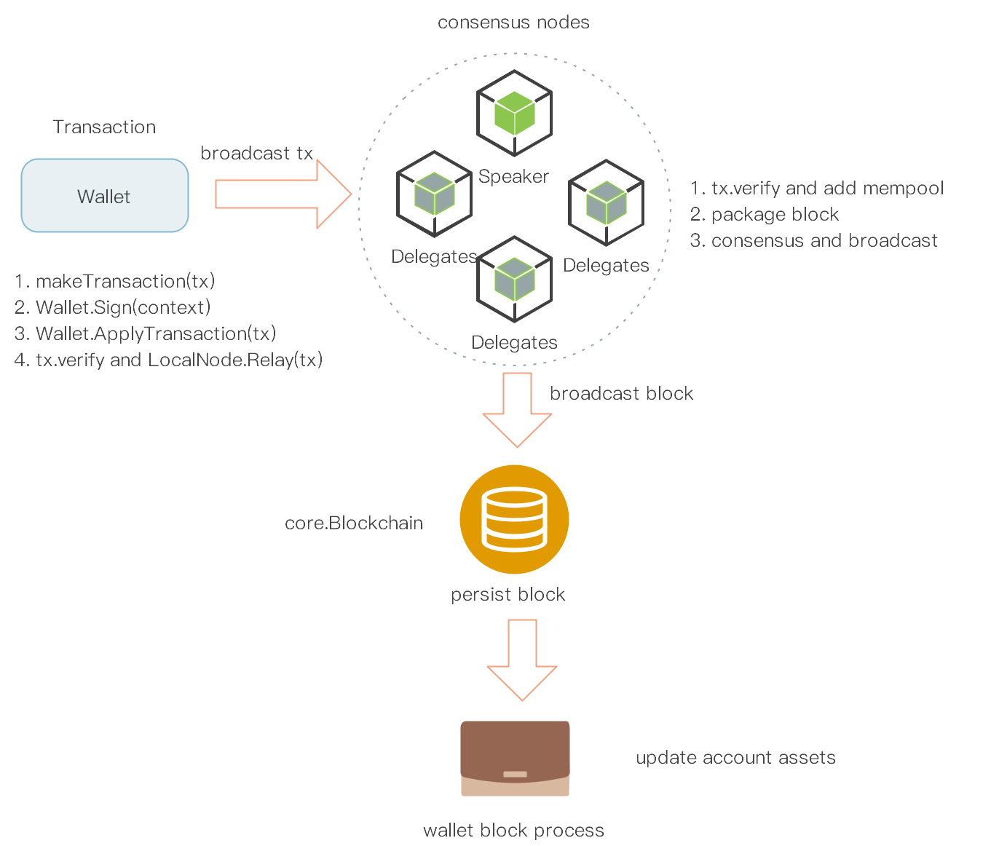

# Transactions  

<!-- TOC -->

- [Transactions](#transactions)
    - [Changes in NEO3](#changes-in-neo3)
    - [Transaction Structure](#transaction-structure)
        - [version](#version)
        - [sender](#sender)
        - [systemFee](#systemfee)
        - [networkFee](#networkfee)
        - [attributes](#attributes)
            - [*usage*](#usage)
        - [cosigners](#cosigners)
            - [Scopes](#scopes)
        - [script](#script)
        - [witnesses](#witnesses)
            - [*InvocationScript*](#invocationscript)
            - [*VerificationScript*](#verificationscript)
    - [Transaction Serialization](#transaction-serialization)
    - [Transaction Signature](#transaction-signature)

<!-- /TOC -->

A Neo Transaction is a signed data package with an instruction for the network and the only way to operate the Neo network. Each block in the Neo blockchain ledger contains one or more transactions, making each block a transaction batch. After transaction attributes encapsulated and signed by the client wallet, the transaction is sent to the node to which the wallet belongs. Any node in the network can verify the received transaction and forward it to the consensus node. The consensus node selectively packages transactions into a proposal block and broadcast it to reach an agreement. Once the validators agree on the new block, they will broadcast the new block to the entire network. For the new block received, the node will process all individual transactions in the block and then update the ledger.



## Changes in NEO3

- UPDATE
    - [System Fee](#systemfee): cancel the free discount of 10 GAS for each transaction and redefine the [fee](../NeoVM#fee) of each OpCode
    - [Network Fee](#networkfee): redefine the calculation formula for the network fee

- DELETE
    - Transaction Type: discard the previous 9 types of the transaction in NEO2 and use the unified `transaction` instead, as well as the redefinition of the [transaction structure](#transaction-structure)
    - [Assets](../SmartContract#native-contract): discard the UTXO model for the NEO and GAS token, using the account model implemented by the native contract instead


## Transaction Structure
> **updated in NEO3**： unified `transaction` type and updated the data structure.

A normal transaction has the following attributes:

| Field             | Type      | Description                                                  |
| ----------------- | --------- | ------------------------------------------------------------ |
| `version`         | byte      | the version of the transaction, currently 0                  |
| `nonce`           | uint      | random number                                                |
| `validUntilBlock` | uint      | block expiration time                                        |
| `sender`          | UInt160   | address script hash of the sender                            |
| `systemFee`       | long      | fee to pay the network for resource usage                    |
| `networkFee`      | long      | fee to pay the validator for including transactions in the block |
| `attributes`      | tx_attr[] | additional features for the transaction                      |
| `cosigners` | Cosigner[]   | scope where the witness is valid  |
| `script`          | byte[]    | contract script of the transaction                           |
| `witnesses`       | Witness[] | scripts used to validate the transaction                     |

### version 
The version attribute allows updates to the transaction structure with backward compatibility, currently 0. 
### sender
Since NEO3 abandoned UTXO model with only account balance model retained. The transfer transaction of the native assets NEO and GAS are unified as the way of NEP-5 assets, so the input and output fields are removed from the transaction structure, instead, the sender field is used to track the source of the transaction. This field is the script hash of the transaction initiation account in the wallet.
### systemFee
The system fee is calculated by opcodes to be executed by the Neo virtual machine, please refer to [opcode fee](../NeoVM#fee) section for specific fee on each opcode. The 10 GAS free system fee will be cancled in NEO3. The total fee is subject to the quantity and type of instructions in the contract script. The calculation formula is as follows:


where *OpcodeSet* is opcode set, 𝑂𝑝𝑐𝑜𝑑𝑒𝑃𝑟𝑖𝑐𝑒<sub>𝑖</sub> is the cost of opcode *i*, 𝑛<sub>𝑖</sub> is the execution times of instruction *i* in the contract script.

### networkFee
The network fee is the fee paid by users when they submit transactions to the Neo network and it will be paied to the validator for producing new block. For each transaction, there is a base minimum network fee which is calculated as the followig formular. Transaction will be executed only when user pays network fee equal to or higher than the base network fee. Otherwise, transaction will be invalid.


where *VerificationCost* is the costs for transaction signature verification in NeoVM, *tx.Length* is the byte length of transaction data, *FeePerByte* is the fee per byte, which is 0.00001GAS. 

### attributes
Depending on the transaction type, it is allowed to add attributes to the transaction. For each attribute, a usage type has to be specified, together with the external data and the size of the external data.

| Field   | Type   | Description                                                  |
| ------- | ------ | ------------------------------------------------------------ |
| `usage` | uint8  | attribute usage type                                         |
| `data`  | byte[] | script of the transaction to be validated. When usage is `0x20` , the data type must be UInt160. |

#### *usage*
The following usage types can be included in the transaction attributes.


| Value  | Name       | Description                                 | Type   |
| ------ | ---------- | ------------------------------------------- | ------ |
| `0x81` | `Url`      | URL for description                         | `byte` |

A maximum of 16 attributes can be added to each transaction.

### cosigners

Currently the witness is valid in the global scope. In order to enable users to control the scope of signatures more finely, NEO3 has changed the cosigners field in the transaction structure to realize the function that witnesses are limited to verifying specified contracts. When `checkwitness` is used for transaction verification, all cosigners except `sender` should define the scope of their signatures.

| Field | Description|  Type|
|--------------|------------------| --|
| `Account`   | scripthash of the account  |  `UInt160` |
| `Scopes` | indicate the scope of the witness   |  `WitnessScope` |
| `AllowedContracts`  |  the verifiable contracts  | `UInt160[]` |
| `AllowedGroups` | the  verifiable contract group | `ECPoint[]` |

#### Scopes

The Scopes field defines the scope of witness, including the following four types:

| Value    | Name| Description| Type|
|---------------|-------------|---------------|--------------|
| `0x00`           | `Global`          | allow the witness in all contexts (default Neo2 behavior), with backwards-compatibility   | `byte`  |
| `0x01`           | `CalledByEntry`          | the callingscript must be the entry script    | `byte`  |
| `0x10`           | `CustomContracts`          |  custom hash for contract-specific    | `byte`  |
| `0x20`           | `CustomGroups`          | custom pubkey for contract group members    | `byte`  |


### script
Contract script executed by the virtual machine.
### witnesses 
A witness is used to verify the validity and integrity of the transaction. There are two attributes for each witness in the witnesses array.

| Field                | Description                                                  |
| -------------------- | ------------------------------------------------------------ |
| `InvocationScript`   | Script to push validation signatures to the verification script |
| `VerificationScript` | Verification script to push the public keys corresponding to the contract |

You can add multiple witnesses to each transaction or use a multi-signature witness as well.

#### *InvocationScript*

The InvocationScript is constructed with the following steps:

1.    `0x40`（PUSHBYTES64） followed by the (first) 64-byte signature

The InvocationScript can push multiple signatures for a multi-signature contract by repeating these steps.

#### *VerificationScript*
VerificationScript, including ordinary address scripts, or multi-signature address scripts.  This address script could be retrieved from wallet account. Please refer to [wallet-account](../Wallets#address) for details.

VerificationScript also could be custom authentication contract scripts.

##  Transaction Serialization

Except for IP addresses and ports, all variable-length integer types in Neo are stored in the small-endian mode. The serialization operation takes the following order to serialize a transaction:

| Field             | Description                                                  |
| ----------------- | ------------------------------------------------------------ |
| `version`         | -                                                            |
| `nonce`           | -                                                            |
| `sender`          | -                                                            |
| `systemFee`       | -                                                            |
| `networkFee`      | -                                                            |
| `validUntilBlock` | -                                                            |
| `attributes`      | First serialize the array length using `WriteVarInt (length)', and then serialize the elements of the array separately |
| `cosigners`      | First serialize the array length using `WriteVarInt (length)', and then serialize the elements of the array separately |
| `script`          | First serialize the array length using `WriteVarInt (length)', and then serialize the elements of the array separately |
| `witnesses`       | First serialize the array length using `WriteVarInt (length)', and then serialize the elements of the array separately |


> Note: WriteVarInt (value) stores variable-length types based on the value itself, and determines the storage size according to the value range.
>
> | Value Range         | Type                 |
> | ------------------- | -------------------- |
> | value < 0xFD        | byte(value)          |
> | value <= 0xFFFF     | 0xFD + ushort(value) |
> | value <= 0xFFFFFFFF | 0xFE + uint(value)   |
> | value > 0xFFFFFFFF  | 0xFF + value         |

## Transaction Signature
Transaction signature is to sign the data of the transaction itself (not including signature-attached data, namely witness) by using ECDSA digital signature algorithm, and then add it to `witnesses` in transaction object.

Here is a json string of the transaction, where the script and witnesses are encoded with Base64, not Hexstring: 

```Json
{
  "hash": "0x2b03f7a8db3649c9e2cb6d429dd358819b3fd536825d2a698e19de237583e60a",
  "size": 57,
  "version": 0,
  "nonce": 0,
  "sender": "Abf2qMs1pzQb8kYk9RuxtUb9jtRKJVuBJt",
  "sys_fee": "0",
  "net_fee": "0",
  "valid_until_block": 0,
  "attributes": [],
  "cosigners": [],
  "script": "aBI+f+g=",
  "witnesses": [
    {
      "invocation": "",
      "verification": "UQ=="
    }
  ],
  "blockhash": "0x7d581e115ebe1c512eef985fd52d75336acb77826dafacc3281399a0e6204958",
  "confirmations": 1,
  "blocktime": 1468595301000,
  "vmState": "HALT"
}
```

*Click [here](../../cn/交易) to see the Chinese edition of the Transactions*