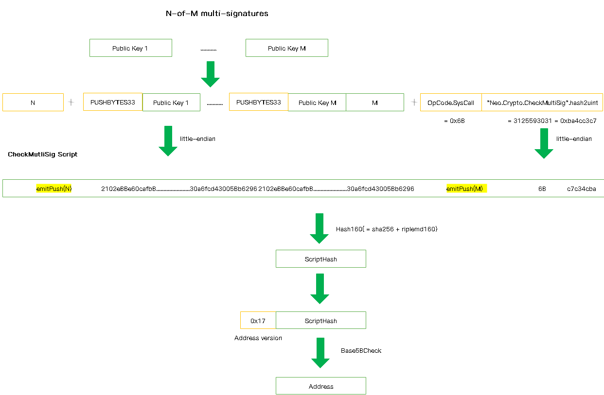
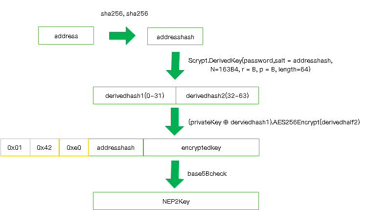

# Wallets

<!-- TOC -->

- [Wallets](#wallets)
    - [Changes in NEO3](#changes-in-neo3)
    - [Accounts](#accounts)
        - [Private Key](#private-key)
        - [Public Key](#public-key)
        - [Address](#address)
            - [Ordinary Address](#ordinary-address)
            - [Multi-Signature Address](#multi-signature-address)
    - [Wallet File](#wallet-file)
        - [DB3 File](#db3-file)
        - [NEP6 File](#nep6-file)
            - [Encryption Steps](#encryption-steps)
            - [Decryption Steps](#decryption-steps)
    - [Signature](#signature)

<!-- /TOC -->

The wallet is a basic component of Neo and the bridge for users to access the Neo network. It's responsible for transaction operations such as transfer, contract deployment, asset registration, etc.

Developers are allowed to redesign and modify the Neo wallet under the following rules and patterns.

## Changes in NEO3

- UPDATE
    - [Address Script](#address): change the way to construct the address script with the public key
        - Ordinary Address

        ```
        NEO2: 0x21 + publicKey(compressed 33bytes) + 0xac
        NEO3: 0x21 + publicKey(compressed 33bytes) + 0x68 + 0x747476aa
        ```

        - Multi-Signature Address

        ```
        NEO2: emitPush(N) + 0x21 + publicKey1(compressed 33bytes) + .... + 0x21 + publicKeym(compressed 33bytes)  + emitPush(M) + 0xae
        NEO3: emitPush(N) + 0x21 + publicKey1(compressed 33bytes) + .... + 0x21 + publicKeym(compressed 33bytes)  + emitPush(M) + 0x68 + 0xc7c34cba
        ```

## Accounts
In Neo, the account is the smart contract and the address represents a contract script. The below flow diagram shows how to derive the public key from the private key and then to the address:


### Private Key

A private key is a random value generated between 1 and N (N is a constant, less than 2^256 slightly), and is represented by a 256 bit (32 bytes) number generally.

There are two main encoding formats for private keys in Neo.

- **hexString Format**：

   The hexString format is a string that uses hexadecimal characters to represent byte array.

- **WIF Format**：

   The WIF format is to add prefix `0x80` and suffix `0x01` in the original 32-bit data and get a string of Base58Check encoding.

   

Example:

| Format     | Value                                                        |
| ---------- | ------------------------------------------------------------ |
| byte[]     | [0xc7,0x13,0x4d,0x6f,0xd8,0xe7,0x3d,0x81,0x9e,0x82,0x75,0x5c,0x64,0xc9,0x37,0x88,0xd8,0xdb,0x09,0x61,0x92,0x9e,0x02,0x5a,0x53,0x36,0x3c,0x4c,0xc0,0x2a,0x69,0x62] |
| hexString | c7134d6fd8e73d819e82755c64c93788d8db0961929e025a53363c4cc02a6962 |
| WIF        | L3tgppXLgdaeqSGSFw1Go3skBiy8vQAM7YMXvTHsKQtE16PBncSU         |


### Public Key

The public key is a point (x, y) obtained through the ECC algorithm with the private key. The X, Y points can be represented by 32-byte data. Different from Bitcoin, Neo chooses secp256r1 as the curve of the ECC algorithm. There are two public key formats as following.

- **Uncompressed Public Key**: 0x04 + X (32 bytes) + Y (32 bytes)

- **Compressed Public Key**: 0x02/0x03 + X (32 bytes)

Example:

| Format                    | Value                                                        |
| ------------------------- | ------------------------------------------------------------ |
| Private Key               | c7134d6fd8e73d819e82755c64c93788d8db0961929e025a53363c4cc02a6962 |
| Public Key (Compressed)   | 035a928f201639204e06b4368b1a93365462a8ebbff0b8818151b74faab3a2b61a |
| Public Key (Uncompressed) | 045a928f201639204e06b4368b1a93365462a8ebbff0b8818151b74faab3a2b61a35dfabcb79ac492a2a88588d2f2e73f045cd8af58059282e09d693dc340e113f |

### Address
> Note: The address script in NEO3 has changed not using the Opcode.CheckSig and OpCode.CheckMultiSig but the interoperable service call `SysCall "Neo.Crypto.CheckSig".hash2uint`, `SysCall "Neo.Crypto .CheckMultiSig".hash2unit` instead.
#### Ordinary Address

1. Build a `CheckSig` script with the public key, and the format is as follows: ***(changed in NEO3)***

     ```bash
    0x21 + Public Key(Compressed 33 bytes) + 0x68 + 0x747476aa
    ```
    

2. Calculate script hash of the contract (20 bytes, make once SHA256 and RIPEMD160 of the script)
3. Add the version prefix in the hash. (Currently, the NEO version is `0x17`)
4. Make Base58Check encoding for the above byte data.


Example：

| Format                  | Value                                                        |
| ----------------------- | ------------------------------------------------------------ |
| Private Key             | 3bf2c2c3a43ee817c5a7704b60e5265e73e585eb85b17091c451ddf72fd80c41 |
| Public Key (Compressed) | 02208aea0068c429a03316e37be0e3e8e21e6cda5442df4c5914a19b3a9b6de375 |
| Script                  | 2102208aea0068c429a03316e37be0e3e8e21e6cda5442df4c5914a19b3a9b6de37568747476aa |
| Address                 | Aa63RMYRWHPRcrZNzUnq5SNrPqoV866Spu                           |


#### Multi-Signature Address

1. Construct an N-of-M `CheckMultiSig` script with multiple addresses. The script format is as follows: ***(changed in NEO3)***

    ```bash
    emitPush(N) + 0x21 + Public Key1(Compressed 33 bytes)  + .... + 0x21 + Public KeyM + emitPush(M) +  0x68 + 0xc7c34cba
    ```

    

2. Calculate script hash of the contract (20 bytes, make once SHA256 and RIPEMD160 of the script).
3. Add the version prefix in the hash. (Currently, the NEO version is `0x17`)
4. Make Base58Check encoding for the above byte data.

Example:

| Format                  | Value                                                        |
| ----------------------- | ------------------------------------------------------------ |
| Private Key             | 97374afac1e801407d6a60006e00d555297c5019788795f017d4cd1fff3df529， aab9d4e4223e088aa6eb1f0ce75c11d149625f6d6a19452d765f8737200a4c35 |
| Public Key (Compressed) | 035fdb1d1f06759547020891ae97c729327853aeb1256b6fe0473bc2e9fa42ff50，03eda286d19f7ee0b472afd1163d803d620a961e1581a8f2704b52c0285f6e022d |
| Script                  | 5221035fdb1d1f06759547020891ae97c729327853aeb1256b6fe0473bc2e9fa42ff502103eda286d19f7ee0b472afd1163d803d620a961e1581a8f2704b52c0285f6e022d5268c7c34cba |
| Address                 | AQuqfBZmzejZt4CQc7mkgvEXmSvdMUEBok                           |


> Please pay attention to the interval of the number for the usage of `emitPush(number)`. Here is an example in the case of the number being BigInteger:

| Number           | Emit OpCode                        | Value            |
| ---------------- | ---------------------------------- | ---------------- |
| -1               | OpCode.PUSHM1                      | 0x4F             |
| 0                | OpCode.PUSH0                       | 0x00             |
| 0 < number <= 16 | OpCode.PUSH1 - 1 + (byte)number    | 0x51 -1 + number |
| number > 16      | number.bytes.length + number.bytes |                  |


## Wallet File    

### DB3 File

db3 wallet file uses SQLite to store data, and the file suffix is `.db3`. There are four tables created in db3 file：

- **Account**

    | Field               | Type          | isRequired | Note             |
    | ------------------- | ------------- | ---------- | ---------------- |
    | PrivateKeyEncrypted | VarBinary(96) | Yes        | AES256 encrypted |
    | PublicKeyHash       | Binary(20)    | Yes        | Primary Key      |

- **Address**

    | Field      | Type       | isRequired | Note        |
    | ---------- | ---------- | ---------- | ----------- |
    | ScriptHash | Binary(20) | Yes        | Primary Key |

- **Contract**

    | Field         | Type       | isRequired | Note                                               |
    | ------------- | ---------- | ---------- | -------------------------------------------------- |
    | RawData       | VarBinary  | Yes        |                                                    |
    | ScriptHash    | Binary(20) | Yes        | Primary Key，Foreign Key，associated Address table |
    | PublicKeyHash | Binary(20) | Yes        | Index，Foreign Key，associated Account table       |

- **Key**

    | Field | Type        | isRequired | Note        |
    | ----- | ----------- | ---------- | ----------- |
    | Name  | VarChar(20) | Yes        | Primary Key |
    | Value | VarBinary   | Yes        |             |


In `Key` table，it mainly stores the AES256 attributes:

- `PasswordHash`:  the hash of the password by using SHA256 method.
- `IV`: a randomly generated initial vector of AES.
- `MasterKey`: an encrypted ciphertext, obtained by encrypting the private key by AES256 method with `PasswordKey`, `IV` as the parameters.
- `Version`: the version of the wallet


> The db3 wallet uses the AES (symmetrical encryption) as its encryption and decryption method.
>
> The db3 wallet is commonly used in wallets of the exchange to facilitate a large amount of account information storage and the retrieval queries.

### NEP6 File

NEP6 wallet file meets the NEP6 standard, and the file suffix is `.json`. The JSON format is as follows:

```json
{
	"name": null,
	"version": "3.0",
	"scrypt": {
		"n": 16384,
		"r": 8,
		"p": 8
	},
	"accounts": [{
		"address": "Nhet9QtFPWzBNB7sRXcRPPbMdjVmkYWCC5",
		"label": null,
		"isDefault": false,
		"lock": false,
		"key": "6PYV2baXHjFYhEN8z1M9ca6Tmj6v1MmugtFeEfVfEL1vUQxMVpPHCtr7bW",
		"contract": {
			"script": "IQNCaDWy3nPIdBMO4YprNZasTMXDs\u002BjS2iue5GxBTltOp1BoCpBq1A==",
			"parameters": [{
				"name": "signature",
				"type": "Signature"
			}],
			"deployed": false
		},
		"extra": null
	}],
	"extra": null
}
```

> The password of this example is `123456`

| Field                       | Description                                                  |
| --------------------------- | ------------------------------------------------------------ |
| name                        | a label that the user attaches to the wallet file            |
| version                     | currently fixed at 1.0 and will be used for functional upgrades in the future |
| scrypt（n/r/p）             | (n/r/p) are parameters for scrypt algorithm used for encrypting and decrypting the private keys in the wallet |
| accounts                    | an array of Account objects which describe the details of each account in the wallet |
| account.address             | account address                                              |
| account.label               | account label, null by default                               |
| account.isDefault           | whether is the default account of wallet                     |
| account.lock                | whether the account is locked                                |
| account.key                 | export nep2key of the privatekey                             |
| account.contract            | the contract of the script                                   |
| account.contract.script     | address script                                               |
| account.contract.parameters | parameter list for the address script contract               |
| account.contract.parameter.name |     parameter name for the address script contract       
| account.contract.parameter.type |     parameter name for the address script contract     |
| account.contract.deployed       | whether is deployed                          |
| account.extra                   | additional attributes of the account, null by default          |
| extra                           | additional attributes of the wallet, null by default |

NEP6 wallet uses `scrypt` algorithm as the core method of wallet encryption and decryption which is NEP2.

#### Encryption Steps



1. The address is derived from the public key, and the address hash is computed through `SHA256(SHA256(Address))`

2. Calculate a `derivedkey` using the `Scrypt` algorithm, and divide the 64-byte data into two halves as `derivedhalf1` and `derivedhalf2`. Scrypt uses the following parameters:

   - ciphertext: password entered (UTF-8 format)
   - salt: address hash
   - n：16384
   - r：8
   - p: 8 
   - length: 64

3. Perform xor operation on the private key and `derivedhalf1`, and then use `derivedhalf2` to encrypt the result with the AES256 algorithm to get the `encryptedkey` .

4. Concat the data in the following format and encode it with Base58Check to get `NEP2Key`.

   ```
   0x01 + 0x42 + 0xe0 + addressHash + encryptedKey
   ```

#### Decryption Steps

1. Decode `NEP2Key` with Base58Check.

2. Verify whether the length of the result is 39 and the first three bytes are `0x01`, `0x42` and `0xe0`.
3. Take data[3-6] as `addresshash`
4. Pass the password and addresshash as the parameters in the Scrypt algorithm. Specify the length of the result to 64 bytes and then get the `Derivedkey`.
5. Take Derivedkey[0-31] as `Derivedhalf1`, and Derivedkey[32-63] as `Derivedhalf2`.
6. Take data[7-38] as `Encryptedkey` (32 bytes), and decrypt it by AES256 algorithm with `Derivedhalf2` as the initial vector.
7. Perform xor operation on the decrypted data and `Derivedhalf1` to obtain the private key.
8. Calculate the public key from the private key with ECC algorithm, and then generate the address. Perform Sha256 on the address twice and then take the first four bytes of the result to check whether it is identical with the `addresshash`. If so, the private key is correct.


NEP2 proposal: <https://github.com/neo-project/proposals/blob/master/nep-2.mediawiki>

NEP6 proposal: <https://github.com/neo-project/proposals/blob/master/nep-6.mediawiki>

> The NEP6-JSON wallet is currently recommended for higher security and cross-platform features.


## Signature

Neo employs the `ECDSA` algorithm to sign the transaction through the wallet component and take the `nistP256` or `Secp256r1` as the ECC curve and SHA256 as the hash algorithm.

C# code：

```C#
 public byte[] Sign(byte[] message, byte[] prikey, byte[] pubkey)
 {
     using (var ecdsa = ECDsa.Create(new ECParameters
                                     {
                                         Curve = ECCurve.NamedCurves.nistP256,
                                         D = prikey,
                                         Q = new ECPoint
                                         {
                                             X = pubkey.Take(32).ToArray(),
                                             Y = pubkey.Skip(32).ToArray()
                                         }
                                     }))
     {
         return ecdsa.SignData(message, HashAlgorithmName.SHA256);
     }
 }
```

Java code：

```java
   public byte[] sign(byte[] message, byte[] privateKey, byte[] publicKey) {
        ECDSASigner signer = new ECDSASigner();
        BigInteger d = new BigInteger(1, privateKey);
        ECPrivateKeyParameters privateKeyParameters = new ECPrivateKeyParameters(d, ECC.Secp256r1);
        signer.init(true, privateKeyParameters);

        BigInteger[] bi = signer.generateSignature(sha256(message));
        byte[] signature = new byte[64];
        System.arraycopy(BigIntegers.asUnsignedByteArray(32, bi[0]), 0, signature, 0, 32);
        System.arraycopy(BigIntegers.asUnsignedByteArray(32, bi[1]), 0, signature, 32, 32);
        return signature;
    }
```

Example:

| Format      | Value                                                        |
| ----------- | ------------------------------------------------------------ |
| data        | hello world                                                  |
| PrivateKey | f72b8fab85fdcc1bdd20b107e5da1ab4713487bc88fc53b5b134f5eddeaa1a19 |
| PublicKey  | 031f64da8a38e6c1e5423a72ddd6d4fc4a777abe537e5cb5aa0425685cda8e063b |
| signature   | 261e894dd456a190f9e99e39cea9f64ca4f939b24cf47ee3498bf883967035b446f554753d5f76219397bc2abb281a13a3c3acce43978c02c510ccb91cb03f87 |

*Click [here](../../cn/钱包) to see the Chinese edition of the Wallets*